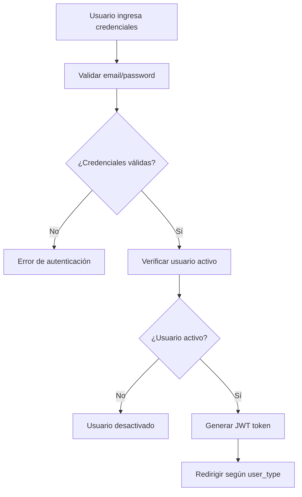

# Usuarios y Permisos

Sistema de gestión de usuarios con 4 tipos principales y matriz de permisos granular.

## 👥 Tipos de Usuario

### 🌐 Cliente (CLIENT)
**Acceso**: Portal cliente (`/portal/`)

**Características**:
- Usuario externo a la universidad
- Solo puede ver sus propios proyectos
- Puede crear solicitudes de servicio
- Recibe notificaciones de progreso

**Permisos**:
```json
{
  "portal": true,
  "create_requests": true,
  "view_own_projects": true,
  "comment_on_tasks": true,
  "approve_deliverables": true
}
```

### 👨‍💼 Colaborador (COLLABORATOR)
**Acceso**: Dashboard interno (`/dashboard/`)

**Características**:
- Empleado de Medialab
- Ejecuta tareas asignadas
- Ve proyectos de su área/especialidad
- Puede actualizar estados de tareas

**Permisos**:
```json
{
  "dashboard": true,
  "view_assigned_tasks": true,
  "update_task_status": true,
  "create_deliverables": true,
  "upload_files": true,
  "add_task_links": true,
  "view_team_projects": true,
  "manage_inventory_assignments": true,
  "create_time_logs": true
}
```

### 🛡️ Administrador (ADMIN)
**Acceso**: Dashboard interno (`/dashboard/`)

**Características**:
- Gestiona proyectos y equipos
- Aprueba/rechaza solicitudes
- Asigna tareas y recursos
- Ve reportes y métricas

**Permisos**:
```json
{
  "dashboard": true,
  "all_collaborator_permissions": true,
  "manage_projects": true,
  "assign_tasks": true,
  "approve_requests": true,
  "manage_users": true,
  "view_reports": true,
  "manage_inventory": true,
  "create_projects": true
}
```

### 👑 Super Administrador (SUPERADMIN)
**Acceso**: Godmode (`/godmode/`)

**Características**:
- Control total del sistema
- Gestión de configuraciones
- Acceso a logs y auditoría
- Mantenimiento del sistema

**Permisos**:
```json
{
  "full_access": true,
  "system_configuration": true,
  "user_management": true,
  "audit_logs": true,
  "data_export": true,
  "backup_restore": true
}
```

## 🗂️ Estructura de Usuarios

### Información Base
| Campo | Cliente | Colaborador | Admin | SuperAdmin |
|-------|---------|-------------|-------|------------|
| name | ✅ | ✅ | ✅ | ✅ |
| email | ✅ | ✅ | ✅ | ✅ |
| phone | ✅ | ✅ | ✅ | ✅ |
| avatar_url | ✅ | ✅ | ✅ | ✅ |

### Información Laboral
| Campo | Cliente | Colaborador | Admin | SuperAdmin |
|-------|---------|-------------|-------|------------|
| employee_code | ❌ | ✅ | ✅ | ✅ |
| employee_role_id | ❌ | ✅ | ✅ | ✅ |
| position | ❌ | ✅ | ✅ | ✅ |
| hire_date | ❌ | ✅ | ✅ | ✅ |
| specialties | ❌ | ✅ | ✅ | ✅ |
| unit_id | ❌ | ✅ | ✅ | ✅ |

### Configuración
| Campo | Cliente | Colaborador | Admin | SuperAdmin |
|-------|---------|-------------|-------|------------|
| is_internal | false | true | true | true |
| is_active | ✅ | ✅ | ✅ | ✅ |
| email_verified | ✅ | ✅ | ✅ | ✅ |

## 🔐 Matriz de Permisos por Módulo

### 📝 Requests (Solicitudes)
| Acción | Cliente | Colaborador | Admin | SuperAdmin |
|--------|---------|-------------|-------|------------|
| Crear solicitud | ✅ | ❌ | ✅ | ✅ |
| Ver propias solicitudes | ✅ | ❌ | ✅ | ✅ |
| Ver todas las solicitudes | ❌ | ❌ | ✅ | ✅ |
| Evaluar solicitudes | ❌ | ❌ | ✅ | ✅ |
| Convertir a proyecto | ❌ | ❌ | ✅ | ✅ |

### 📋 Projects (Proyectos)
| Acción | Cliente | Colaborador | Admin | SuperAdmin |
|--------|---------|-------------|-------|------------|
| Ver proyectos propios | ✅ | ❌ | ✅ | ✅ |
| Ver proyectos asignados | ❌ | ✅ | ✅ | ✅ |
| Ver todos los proyectos | ❌ | ❌ | ✅ | ✅ |
| Crear proyecto | ❌ | ❌ | ✅ | ✅ |
| Editar proyecto | ❌ | ❌ | ✅ | ✅ |
| Asignar unidades | ❌ | ❌ | ✅ | ✅ |

### ✅ Tasks (Tareas)
| Acción | Cliente | Colaborador | Admin | SuperAdmin |
|--------|---------|-------------|-------|------------|
| Ver tareas de mis proyectos | ✅ | ❌ | ✅ | ✅ |
| Ver tareas asignadas | ❌ | ✅ | ✅ | ✅ |
| Crear tareas | ❌ | ❌ | ✅ | ✅ |
| Asignar tareas | ❌ | ❌ | ✅ | ✅ |
| Actualizar estado | ❌ | ✅ | ✅ | ✅ |
| Crear entregables | ❌ | ✅ | ✅ | ✅ |
| Subir archivos | ❌ | ✅ | ✅ | ✅ |
| Agregar enlaces | ❌ | ✅ | ✅ | ✅ |
| Aprobar/rechazar (Nivel 2) | ❌ | ❌ | ✅ | ✅ |
| Aprobar/rechazar (Nivel 3) | ✅ | ❌ | ✅ | ✅ |

### 📦 Inventory (Inventario)
| Acción | Cliente | Colaborador | Admin | SuperAdmin |
|--------|---------|-------------|-------|------------|
| Ver inventario | ❌ | ✅ | ✅ | ✅ |
| Reservar equipo | ❌ | ✅ | ✅ | ✅ |
| Gestionar equipos | ❌ | ❌ | ✅ | ✅ |
| Crear/editar equipos | ❌ | ❌ | ✅ | ✅ |
| Asignar equipos | ❌ | ❌ | ✅ | ✅ |

### 👥 Users (Usuarios)
| Acción | Cliente | Colaborador | Admin | SuperAdmin |
|--------|---------|-------------|-------|------------|
| Ver perfil propio | ✅ | ✅ | ✅ | ✅ |
| Editar perfil propio | ✅ | ✅ | ✅ | ✅ |
| Ver otros usuarios | ❌ | ✅ (equipo) | ✅ | ✅ |
| Crear usuarios | ❌ | ❌ | ✅ | ✅ |
| Editar usuarios | ❌ | ❌ | ✅ | ✅ |
| Desactivar usuarios | ❌ | ❌ | ✅ | ✅ |

### ⚙️ System (Sistema)
| Acción | Cliente | Colaborador | Admin | SuperAdmin |
|--------|---------|-------------|-------|------------|
| Ver configuraciones | ❌ | ❌ | ❌ | ✅ |
| Editar configuraciones | ❌ | ❌ | ❌ | ✅ |
| Ver logs del sistema | ❌ | ❌ | ❌ | ✅ |
| Gestionar seeders | ❌ | ❌ | ❌ | ✅ |
| Backup/Restore | ❌ | ❌ | ❌ | ✅ |

## 🔄 Flujo de Autenticación

### 1. Login


### 2. Redirección por Tipo
```python
def redirect_after_login(user_type: str) -> str:
    redirects = {
        "CLIENT": "/portal/dashboard",
        "COLLABORATOR": "/dashboard/home", 
        "ADMIN": "/dashboard/admin",
        "SUPERADMIN": "/godmode/overview"
    }
    return redirects.get(user_type, "/")
```

### 3. Middleware de Permisos
```python
def check_permission(user: User, action: str, resource: str) -> bool:
    # SuperAdmin tiene acceso total
    if user.user_type.code == "SUPERADMIN":
        return True
    
    # Verificar permisos específicos
    permissions = user.user_type.permissions
    return permissions.get(f"{action}_{resource}", False)
```

## 📱 Gestión de Dispositivos

### Registro de Dispositivos
- **Automático**: Al hacer login desde nuevo dispositivo
- **Información capturada**: Browser, OS, IP, User Agent
- **Device fingerprint**: Para detección de dispositivos

### Dispositivos Confiables
- **Marca como confiable**: Después de verificación por email
- **Beneficios**: Login sin verificación adicional
- **Gestión**: Usuario puede ver y revocar dispositivos

## 📱 Gestión de Dispositivos y Seguridad

### Registro de Dispositivos
- **Automático**: Al hacer login desde nuevo dispositivo
- **Información capturada**: Browser, OS, IP, User Agent
- **Device fingerprint**: Para detección de dispositivos

### Dispositivos Confiables
- **Marca como confiable**: Después de verificación por email
- **Beneficios**: Login sin verificación adicional
- **Gestión**: Usuario puede ver y revocar dispositivos

### Sistema de Bloqueos Inteligente

#### 1. Bloqueo por Usuario (Nivel 1)
| Intentos | Tiempo de Bloqueo | Almacenado en |
|----------|-------------------|---------------|
| 3 intentos fallidos | 5 minutos | Redis |
| 5 intentos fallidos | 30 minutos | Redis |
| 8 intentos fallidos | 2 horas | Redis |
| 10+ intentos | 24 horas | Redis + DB |

#### 2. Bloqueo por Dispositivo (Nivel 2)
**Criterio**: `user_agent + browser_fingerprint`
```json
{
  "device_id": "hash(user_agent + fingerprint)",
  "blocked_until": "2024-01-01T12:00:00Z",
  "attempts_count": 5,
  "reason": "multiple_failed_attempts"
}
```

#### 3. Bloqueo por IP (Nivel 3 - Solo casos extremos)
**Solo para**:
- **Ataques masivos**: +50 intentos en 10 minutos
- **IPs maliciosas conocidas**: Lista negra externa
- **Patrones de bot**: Comportamiento automatizado

#### 4. Bloqueo Total de IP (Nivel 4 - Crítico)
**Criterios**:
- **Ataque DDoS**: +200 requests/minuto
- **Múltiples usuarios afectados**: +10 usuarios bloqueados desde misma IP
- **IP en blacklist**: Reportada como maliciosa

### Arquitectura de Redis
```redis
# Bloqueos por usuario
user_blocks:{user_id} = {
  "attempts": 3,
  "blocked_until": "timestamp",
  "last_attempt": "timestamp"
}

# Bloqueos por dispositivo  
device_blocks:{device_hash} = {
  "attempts": 5,
  "blocked_until": "timestamp",
  "user_agents": ["agent1", "agent2"]
}

# Bloqueos por IP (solo críticos)
ip_blocks:{ip_address} = {
  "reason": "mass_attack",
  "blocked_until": "timestamp", 
  "affected_users": ["user1", "user2"]
}

# Rate limiting general
rate_limit:{ip}:{endpoint} = {
  "requests": 10,
  "window_start": "timestamp"
}
```

### Casos Especiales

#### Empresa con IP Compartida
**Problema**: Toda la empresa usa la misma IP pública
**Solución**: 
- ✅ Bloqueo por usuario individual
- ✅ Bloqueo por dispositivo/fingerprint
- ❌ NO bloquear IP compartida
- ⚠️ Solo alerta si +20 usuarios fallan desde misma IP

#### Universidad con Red Interna
**Problema**: Laboratorios con PCs compartidas
**Solución**:
- ✅ Identificación por user_agent + fingerprint
- ✅ Permitir múltiples usuarios por dispositivo
- ✅ Bloqueo individual por usuario
- ⚠️ Alerta si mismo dispositivo falla con múltiples usuarios

### Configuración Inteligente
```python
# Configuración dinámica basada en contexto
SECURITY_CONFIG = {
    "internal_networks": ["192.168.", "10.0.", "172.16."],
    "university_ranges": ["200.37.64.", "190.12.34."],
    "known_shared_ips": ["201.123.45.67"],  # IPs empresariales conocidas
    
    "rules": {
        "internal_ip": {
            "user_attempts_limit": 10,  # Más tolerante en red interna
            "device_attempts_limit": 15,
            "ip_block_threshold": 100   # Muy alto para IPs internas
        },
        "external_ip": {
            "user_attempts_limit": 5,   # Más estricto externo
            "device_attempts_limit": 8,
            "ip_block_threshold": 20
        },
        "shared_known_ip": {
            "user_attempts_limit": 8,   # Balanceado para empresas
            "device_attempts_limit": 12,
            "ip_block_disabled": True   # Nunca bloquear IPs conocidas
        }
    }
}
```

### Alertas y Monitoreo
| Evento | Alerta a | Acción |
|--------|----------|--------|
| Usuario bloqueado 3+ veces | Admin | Email + Dashboard |
| +5 usuarios desde misma IP | SuperAdmin | Investigar posible compromiso |
| Patrón de ataque detectado | SuperAdmin | Bloqueo automático + Log |
| IP externa con +50 intentos | SuperAdmin | Considerar bloqueo de IP |

### Recovery y Whitelist
- **Auto-recovery**: Bloqueos de usuario se levantan automáticamente
- **Admin override**: Admins pueden desbloquear usuarios manualmente
- **IP Whitelist**: IPs de confianza nunca se bloquean
- **Emergency access**: Código de emergencia para SuperAdmin

## 🔔 Notificaciones por Tipo

### Cliente
- Nueva tarea en su proyecto
- Cambio de estado en tareas
- Solicitud de aprobación de entregables
- Proyecto completado

### Colaborador  
- Nueva tarea asignada
- Cambio de prioridad en tareas
- Comentarios en sus tareas
- Equipos reservados/liberados

### Admin
- Nueva solicitud pendiente
- Tareas vencidas o en riesgo
- Problemas de inventario
- Reportes semanales

### SuperAdmin
- Errores del sistema
- Usuarios nuevos registrados
- Cambios en configuración
- Alertas de seguridad

## 📊 Especialidades por Rol

### Camarógrafo
```json
{
  "equipment": ["CAMARA", "AUDIO", "ILUMINACION"],
  "skills": ["grabacion_video", "fotografia", "streaming"],
  "certifications": []
}
```

### Editor
```json
{
  "software": ["premiere", "after_effects", "davinci"],
  "specialties": ["video_editing", "color_grading", "audio_mixing"],
  "formats": ["4K", "HD", "social_media"]
}
```

### Diseñador
```json
{
  "software": ["photoshop", "illustrator", "figma"],
  "specialties": ["graphic_design", "ui_ux", "branding"],
  "output_types": ["print", "digital", "web"]
}
```

## 🔄 Estados de Usuario

### Estados Generales
| Estado | Descripción | Puede hacer login |
|--------|-------------|-------------------|
| **Activo** | Usuario normal | ✅ |
| **Inactivo** | Temporalmente deshabilitado | ❌ |
| **Pendiente** | Email no verificado | ⚠️ (limitado) |
| **Suspendido** | Violación de políticas | ❌ |

### Estados Específicos para Colaboradores
| Estado | Descripción | Puede hacer login | Tareas asignadas |
|--------|-------------|-------------------|------------------|
| **Activo** | Empleado trabajando normalmente | ✅ | Visible y editable |
| **Vacaciones** | Empleado en vacaciones | ✅ | Visible, solo lectura |
| **Licencia** | Empleado en licencia médica/personal | ❌ | Visible, reasignables |
| **Ex-empleado** | Ya no trabaja en el departamento | ❌ | Visible, solo lectura |

### Gestión de Ex-empleados
**Propósito**: Mantener historial sin eliminar datos

**Características**:
- **Login**: Bloqueado permanentemente
- **Tareas históricas**: Visibles como "Creado por [Nombre] (Ex-empleado)"
- **Proyectos**: Historial conservado con nota de estado
- **Equipos**: Automáticamente des-asignados
- **Nuevas asignaciones**: Imposibles

**Ventajas**:
- ✅ Preserva historial de trabajo
- ✅ Mantiene trazabilidad de tareas
- ✅ No rompe relaciones de BD
- ✅ Facilita auditorías futuras