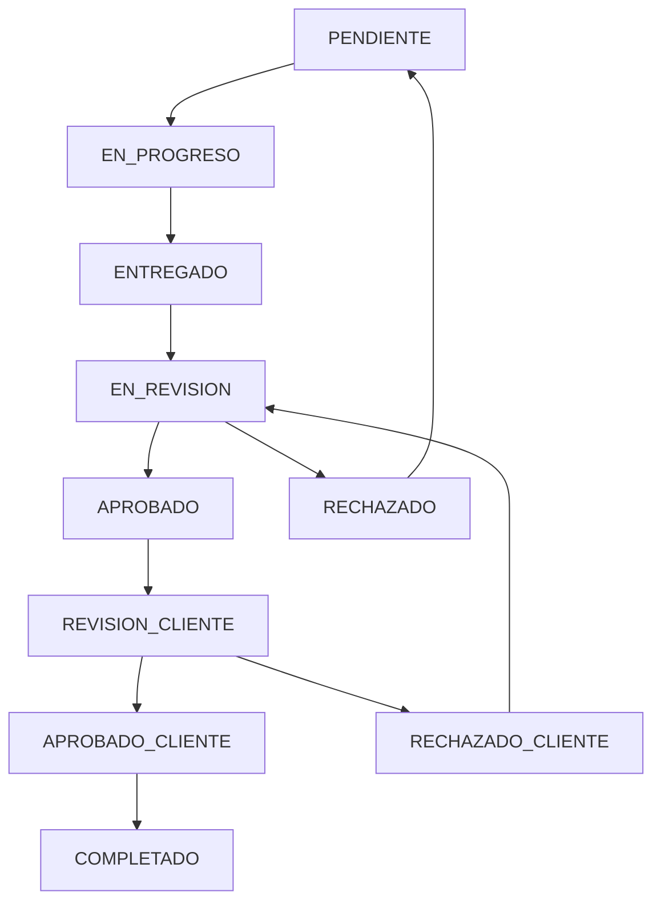
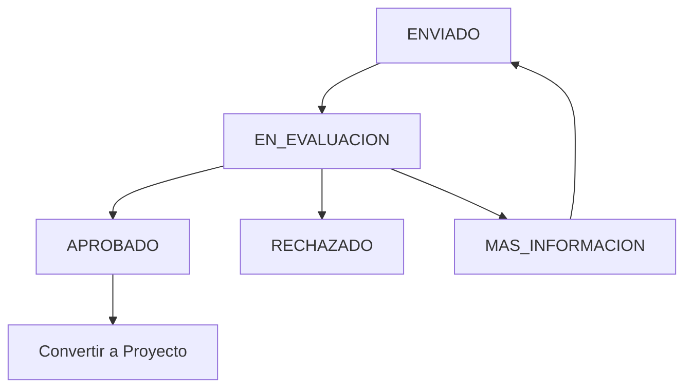

# Flujo de Estados

Sistema unificado de estados con niveles jerárquicos y transiciones automáticas.

## 🔄 Estados de Tareas (TASKS)

### Nivel 1: Ejecución de Tarea
| Estado | Level | Descripción | Color |
|--------|-------|-------------|-------|
| PENDIENTE | 1 | Tarea asignada pero no iniciada | `#6b7280` |
| EN_PROGRESO | 1 | Tarea en desarrollo | `#f59e0b` |
| ENTREGADO | 1 | Tarea entregada para revisión | `#3b82f6` |
| COMPLETADO | 1 | Tarea finalizada completamente | `#22c55e` |

### Nivel 2: Revisión Interna
| Estado | Level | Descripción | Color |
|--------|-------|-------------|-------|
| EN_REVISION | 2 | En proceso de revisión | `#8b5cf6` |
| APROBADO | 2 | Aprobado por revisor interno | `#22c55e` |
| RECHAZADO | 2 | Rechazado, vuelve a Nivel 1 | `#ef4444` |

### Nivel 3: Feedback Cliente
| Estado | Level | Descripción | Color |
|--------|-------|-------------|-------|
| REVISION_CLIENTE | 3 | Esperando feedback del cliente | `#06b6d4` |
| APROBADO_CLIENTE | 3 | Aprobado por cliente | `#10b981` |
| RECHAZADO_CLIENTE | 3 | Rechazado por cliente, vuelve a Nivel 2 | `#f87171` |

### Flujo de Transiciones



## 📋 Estados de Proyectos (PROJECTS)

Estados calculados automáticamente basados en tareas completadas.

| Estado | Descripción | Condición |
|--------|-------------|-----------|
| SOLICITADO | Proyecto solicitado | Estado inicial |
| PLANIFICACION | En planificación | Tareas creadas, 0% completado |
| EN_PROGRESO | En desarrollo | 1-99% tareas completadas |
| REVISION | En revisión final | 100% tareas entregadas |
| COMPLETADO | Proyecto finalizado | 100% tareas aprobadas por cliente |
| EN_PAUSA | En pausa | Manualmente pausado |
| CANCELADO | Cancelado | Manualmente cancelado |

### Cálculo Automático
```
Progreso = (Tareas APROBADO_CLIENTE + COMPLETADO) / Total de Tareas * 100
```

## 📦 Estados de Inventario (INVENTORY)

| Estado | Descripción | Color |
|--------|-------------|-------|
| DISPONIBLE | Disponible para uso | `#22c55e` |
| EN_USO | Asignado y en uso | `#f59e0b` |
| RESERVADO | Reservado para tarea | `#3b82f6` |
| MANTENIMIENTO | En mantenimiento | `#ef4444` |
| REPARACION | En reparación | `#dc2626` |
| RETIRADO | Retirado de servicio | `#6b7280` |

## 📝 Estados de Solicitudes (REQUESTS)

Nueva tabla para manejar solicitudes antes de convertirse en proyectos.

| Estado | Descripción | Acción |
|--------|-------------|--------|
| ENVIADO | Solicitud enviada | Estado inicial |
| EN_EVALUACION | En evaluación | Revisión por admin |
| APROBADO | Aprobada | Se convierte en proyecto |
| RECHAZADO | Rechazada | No se convierte |
| MAS_INFORMACION | Requiere más información | Vuelve a cliente |

### Flujo de Solicitudes



## 🎙️ Estados de Podcasts/Episodios

| Estado | Descripción | Color |
|--------|-------------|-------|
| PLANIFICADO | Episodio planificado | `#6b7280` |
| GRABANDO | En grabación | `#f59e0b` |
| EDITANDO | En edición | `#3b82f6` |
| REVISION | En revisión | `#8b5cf6` |
| LISTO | Listo para publicar | `#22c55e` |
| PUBLICADO | Publicado | `#10b981` |

## 📚 Estados de Clases

| Estado | Descripción | Color |
|--------|-------------|-------|
| PROGRAMADO | Clase programada | `#6b7280` |
| GRABANDO | Grabando clase | `#ef4444` |
| PROCESANDO | Procesando video | `#f59e0b` |
| EDITADO | Editado y listo | `#22c55e` |
| PUBLICADO | Disponible en plataforma | `#10b981` |

## ⚙️ Configuración en Base de Datos

### status_types requeridos:
- `TASKS` → Estados de tareas con niveles
- `PROJECTS` → Estados de proyectos 
- `INVENTORY` → Estados de inventario
- `REQUESTS` → Estados de solicitudes
- `PODCASTS` → Estados de podcasts/episodios
- `CLASSES` → Estados de clases

### Campos importantes en status_options:
- `level` → Nivel jerárquico (1, 2, 3)
- `sort_order` → Orden de visualización
- `color` → Color para UI
- `icon` → Icono representativo

## 🔄 Reglas de Transición

1. **Solo hacia adelante en niveles** (excepto rechazos)
2. **Rechazos regresan al nivel anterior**
3. **Estados de proyecto se calculan automáticamente**
4. **Solicitudes aprobadas generan proyectos**
5. **Inventario solo cambios manuales**