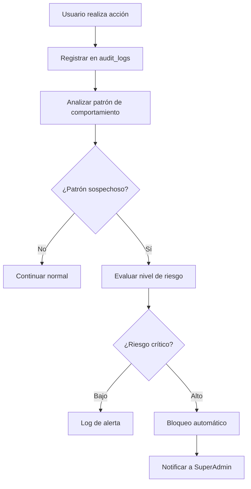

# Workflow - Security & Audit

Sistema integral de seguridad y auditoría para proteger el sistema y mantener trazabilidad completa de todas las acciones.

## 🛡️ **Concepto General de Seguridad**

### **Principio Básico**
**Registrar todo**, **detectar patrones sospechosos**, y **responder automáticamente** a amenazas, manteniendo **trazabilidad completa** para auditorías.

### **Flujo Principal de Seguridad**

## 📊 **Sistema de Audit Logs**

### **¿Qué se Registra?**

#### **Acciones de Usuarios**
- **Logins y logouts** (exitosos y fallidos)
- **Cambios de perfil** (contraseña, email, datos personales)
- **Acceso a información sensible** (proyectos de otros usuarios)
- **Descargas de archivos** importantes

#### **Gestión de Proyectos**
- **Creación y modificación** de proyectos
- **Asignación y reasignación** de tareas
- **Cambios de estado** críticos
- **Aprobación y rechazo** de entregables

#### **Administración del Sistema**
- **Cambios de configuración** del sistema
- **Creación y modificación** de usuarios
- **Cambios de permisos** y roles
- **Acceso a funciones administrativas**

#### **Gestión de Inventario**
- **Asignación de equipos** críticos
- **Cambios de estado** de equipos
- **Reportes de problemas** con equipos
- **Acceso fuera de horario** a inventario

### **Información Capturada por Cada Log**

#### **Datos Básicos**
- **Quién**: ID del usuario, nombre, rol
- **Qué**: Acción específica realizada
- **Cuándo**: Timestamp exacto
- **Dónde**: IP, dispositivo, ubicación geográfica

#### **Contexto Adicional**
- **Datos anteriores**: Valores antes del cambio
- **Datos nuevos**: Valores después del cambio
- **Razón del cambio**: Si el usuario proporcionó justificación
- **Tiempo de ejecución**: Cuánto tardó la operación

#### **Metadatos Técnicos**
- **Sesión**: ID de sesión del usuario
- **Endpoint**: Qué parte del sistema se accedió
- **User Agent**: Navegador y sistema operativo
- **Referrer**: Desde dónde llegó a esa acción

## 🔍 **Detección de Patrones Sospechosos**

### **Patrones de Login Sospechoso**

#### **Múltiples Intentos Fallidos**
- **5 intentos fallidos** en 10 minutos → Bloqueo temporal 30 minutos
- **10 intentos fallidos** en 1 hora → Bloqueo 2 horas + alerta a Admin
- **20 intentos fallidos** en 1 día → Bloqueo 24 horas + alerta a SuperAdmin

#### **Ubicación Geográfica Inusual**
- **Login desde país diferente** → Verificación por email
- **Cambio de ubicación mayor a 500km** en menos de 1 hora → Alerta
- **Multiple IPs simultáneas** → Verificación adicional requerida

#### **Horarios Inusuales**
- **Login fuera de horario laboral** (22:00 - 6:00) → Log especial
- **Login en fines de semana** repetitivo → Revisar si es patrón normal
- **Login en días festivos** → Alerta si no está justificado

### **Patrones de Uso Sospechoso**

#### **Acceso Masivo a Información**
- **Descargar más de 10 archivos** en 1 hora → Alerta
- **Acceder a proyectos de múltiples clientes** rápidamente → Investigar
- **Consultar información de usuarios** sin relación a su trabajo → Alerta

#### **Cambios Masivos**
- **Modificar más de 5 proyectos** en 1 hora → Verificar si es tarea normal
- **Reasignar múltiples tareas** súbitamente → Confirmar con supervisor
- **Cambiar configuraciones críticas** → Requiere justificación obligatoria

#### **Escalamiento de Privilegios**
- **Usuario normal** intentando acciones de admin → Bloqueo inmediato
- **Acceso a URLs administrativas** sin permisos → Alerta crítica
- **Intentos de bypass** de validaciones → Investigación manual

## 🚨 **Niveles de Respuesta Automática**

### **Nivel 1: Monitoreo Silencioso**
**Acciones**:
- Registrar en logs con flag especial
- Incrementar nivel de monitoring para ese usuario
- No interrumpir al usuario

**Ejemplos**:
- Login desde nueva IP (pero mismo país)
- Acceso fuera de horario ocasional
- Descarga de archivos dentro de límites

### **Nivel 2: Verificación Adicional**
**Acciones**:
- Solicitar verificación por segundo factor
- Enviar email de confirmación
- Requerir re-autenticación

**Ejemplos**:
- Login desde nuevo país
- Cambio súbito de ubicación
- Acceso a información sensible

### **Nivel 3: Alerta y Restricción**
**Acciones**:
- Notificar a Admin inmediatamente
- Restringir acceso a funciones críticas
- Requerir aprobación para acciones importantes

**Ejemplos**:
- Múltiples intentos fallidos
- Patrón de acceso masivo a información
- Intentos de escalamiento de privilegios

### **Nivel 4: Bloqueo Inmediato**
**Acciones**:
- Terminar sesión inmediatamente
- Bloquear cuenta temporalmente
- Notificar a SuperAdmin con prioridad crítica
- Requerir intervención manual para desbloquear

**Ejemplos**:
- Intento de bypass de seguridad
- Acceso claramente malicioso
- Compromiso evidente de cuenta

## 👤 **Gestión de Usuarios Sospechosos**

### **Detección de Cuentas Comprometidas**

#### **Indicadores de Compromiso**
- **Cambio súbito de comportamiento** (horarios, ubicación, acciones)
- **Acceso a información** que normalmente no consulta
- **Intentos de modificar** datos de otros usuarios
- **Uso de funciones** que nunca antes había usado

#### **Proceso de Verificación**
1. **Suspensión temporal** de la cuenta
2. **Contacto directo** con el usuario (teléfono, presencial)
3. **Verificación de identidad** y actividades recientes
4. **Revisión de logs** para determinar alcance del compromiso
5. **Reactivación segura** con cambio de contraseña obligatorio

### **Gestión de Ex-empleados**

#### **Desactivación Inmediata**
- **Bloqueo de acceso** en el momento de notificación
- **Terminación de sesiones activas** en todos los dispositivos
- **Revocación de permisos** y accesos especiales
- **Audit completo** de acciones en últimos 30 días

#### **Preservación de Evidencia**
- **Mantener logs** de todas sus acciones históricas
- **Preservar datos** para posibles investigaciones
- **Documentar motivo** de desactivación
- **Registro de quién** autorizó la desactivación

## 🔐 **Políticas de Contraseñas y Acceso**

### **Requisitos de Contraseñas**
- **Mínimo 8 caracteres** con combinación de tipos
- **Cambio obligatorio** cada 90 días (solo para roles críticos)
- **No reutilizar** últimas 5 contraseñas
- **Verificación de fortaleza** en tiempo real

### **Gestión de Sesiones**
- **Timeout automático** después de 8 horas de inactividad
- **Máximo 3 sesiones simultáneas** por usuario
- **Terminación automática** al cambiar contraseña
- **Registro de todas las sesiones** activas

### **Autenticación Multi-factor (Futuro)**
- **Para roles administrativos** (Admin, SuperAdmin)
- **Para accesos desde IPs desconocidas**
- **Para cambios de configuraciones críticas**
- **Para acceso fuera de horario laboral**

## 🌐 **Monitoreo de Red y Acceso**

### **Bloqueo de IPs Sospechosas**

#### **Bloqueo Automático**
- **Múltiples intentos fallidos** desde la misma IP
- **Patrones de ataque** conocidos (fuerza bruta, etc.)
- **IPs en listas negras** de seguridad públicas
- **Países bloqueados** por política institucional

#### **Gestión de IPs Bloqueadas**
- **Lista blanca** para IPs institucionales conocidas
- **Revisión manual** de bloqueos automáticos
- **Desbloqueo temporal** para casos excepcionales
- **Notificación** cuando se bloquea IP de usuario legítimo

### **Monitoreo de Tráfico Inusual**

#### **Indicadores de Ataque**
- **Múltiples requests** por segundo desde una IP
- **Acceso a URLs** que no existen (scanning)
- **Intentos de injection** en formularios
- **Patrones de bot** automatizado

#### **Respuesta Automática**
- **Rate limiting** progresivo
- **CAPTCHA** después de cierto umbral
- **Bloqueo temporal** de IP sospechosa
- **Alerta inmediata** a equipo técnico

## 📋 **Reportes y Alertas de Seguridad**

### **Reportes Automáticos Diarios**
**Para Admin**:
- Intentos de login fallidos del día
- Nuevos usuarios registrados
- Accesos fuera de horario
- Cambios de configuración realizados

**Para SuperAdmin**:
- Resumen de alertas de seguridad
- IPs bloqueadas automáticamente
- Usuarios con comportamiento inusual
- Métricas de seguridad general

### **Alertas Inmediatas**
**Críticas** (SuperAdmin + Admin):
- Intentos de compromiso de cuentas administrativas
- Acceso a funciones críticas sin autorización
- Patrones de ataque detectados
- Bloqueos automáticos de usuarios internos

**Importantes** (Admin):
- Login desde países no autorizados
- Cambios de contraseña múltiples en poco tiempo
- Acceso masivo a información
- Usuarios bloqueados por intentos fallidos

### **Reportes Semanales de Auditoría**
- **Resumen de actividad** por tipo de usuario
- **Patrones de uso** inusuales detectados
- **Efectividad de medidas** de seguridad
- **Recomendaciones** para mejorar seguridad

## 🔄 **Integración con Otros Workflows**

### **Con Workflow Users**
- **Cada acción de usuario** se registra automáticamente
- **Cambios de perfil** disparan auditoría especial
- **Desactivaciones** requieren justificación registrada

### **Con Workflow Projects-Tasks**
- **Cambios críticos** en proyectos se auditan
- **Acceso a proyectos confidenciales** se monitorea
- **Reasignaciones masivas** generan alertas

### **Con Workflow Notifications**
- **Alertas de seguridad** usan sistema de notificaciones
- **Escalamiento automático** por falta de respuesta
- **Coordinación** entre equipos de seguridad

### **Con Workflow Inventory**
- **Acceso a equipos críticos** se registra
- **Cambios de asignación** fuera de horario se alertan
- **Reportes de problemas** se auditan para detectar patrones

## 📊 **Métricas de Seguridad**

### **KPIs de Seguridad**
- **Tiempo promedio** de detección de amenazas
- **Falsos positivos** en alertas automáticas
- **Tiempo de respuesta** a incidentes críticos
- **Cobertura de auditoría** (% de acciones registradas)

### **Análisis de Tendencias**
- **Patrones estacionales** de intentos de acceso
- **Horarios de mayor** actividad sospechosa
- **Tipos de amenazas** más comunes
- **Efectividad de bloqueos** automáticos

## ⚙️ **Configuraciones de Seguridad**

### **Umbrales Configurables**
- **Intentos fallidos** antes de bloqueo
- **Tiempo de bloqueo** por tipo de infracción
- **Número de sesiones** simultáneas permitidas
- **Tiempo de inactividad** antes de logout

### **Políticas por Tipo de Usuario**
- **Cliente**: Políticas más permisivas (solo sus datos)
- **Colaborador**: Monitoreo de acceso a múltiples proyectos
- **Admin**: Auditoría estricta de todas las acciones críticas
- **SuperAdmin**: Registro completo + alertas inmediatas

## 🎯 **Casos Especiales de Seguridad**

### **Incidentes de Seguridad**
- **Proceso definido** para respuesta a incidentes
- **Escalamiento automático** según gravedad
- **Preservación de evidencia** digital
- **Comunicación** con autoridades si es necesario

### **Auditorías Externas**
- **Exportación segura** de logs requeridos
- **Anonimización** de datos sensibles cuando sea posible
- **Trazabilidad completa** de accesos a información
- **Reportes ejecutivos** para compliance

### **Recuperación ante Desastres**
- **Backup de logs** críticos de seguridad
- **Procedimientos** para restaurar auditoría
- **Continuidad** del monitoreo durante incidentes
- **Validación** de integridad de logs restaurados

---

**Relacionado con**:
- [Workflow Users](/documentacion-tecnica/workflows/workflow-users) - Para monitoreo y auditoría de acciones de usuarios
- [Workflow Notifications](/documentacion-tecnica/workflows/workflow-notifications) - Para alertas y escalamiento de seguridad
- [Workflow Projects-Tasks](/documentacion-tecnica/workflows/workflow-projects-tasks) - Para auditoría de cambios críticos en proyectos