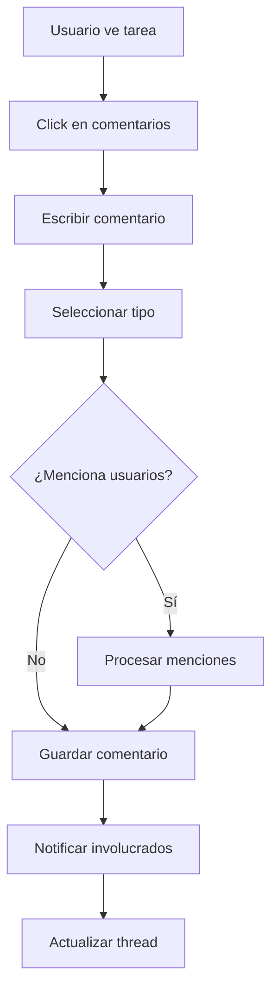
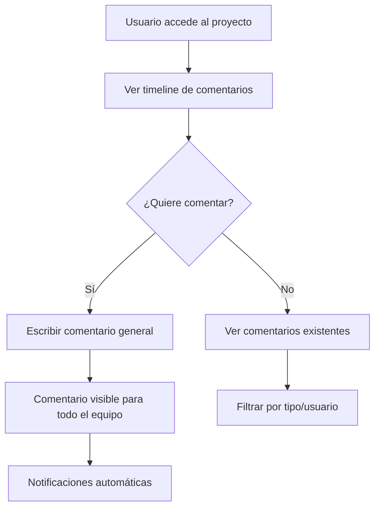
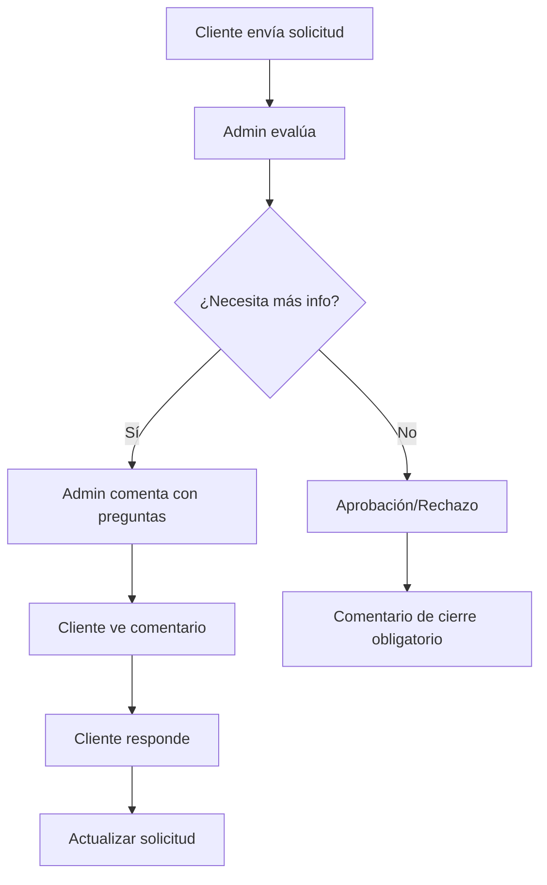
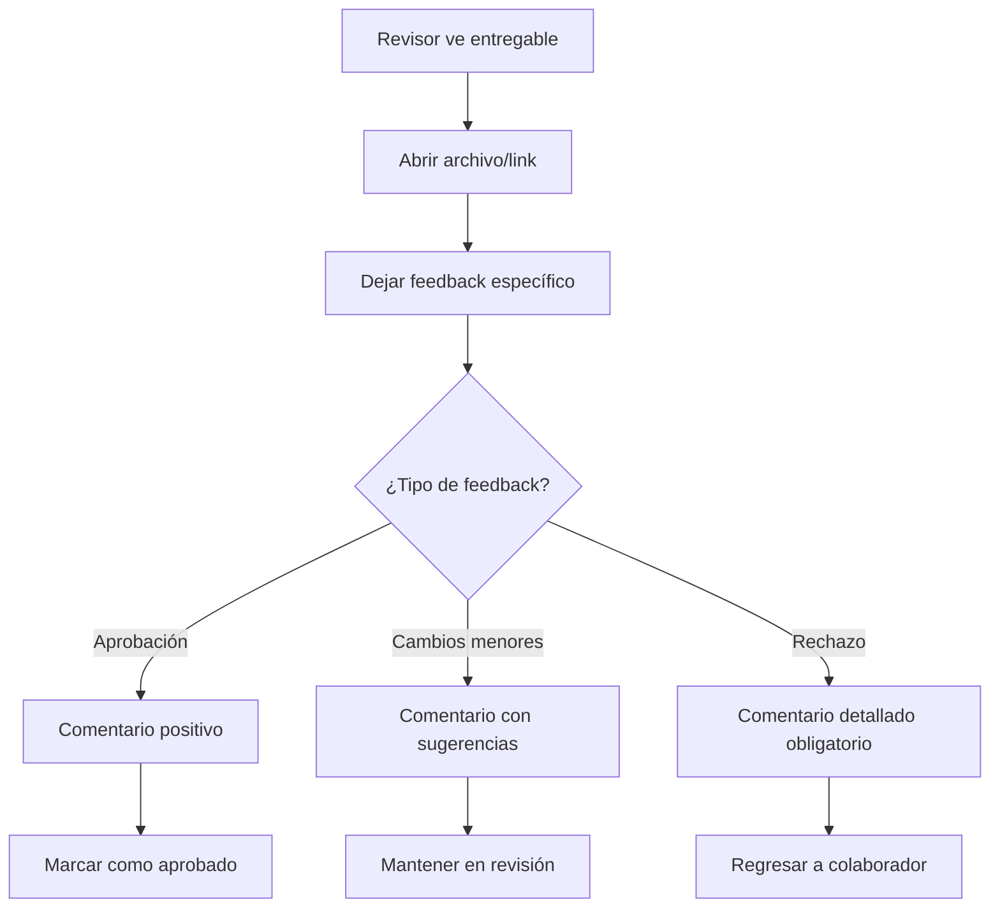
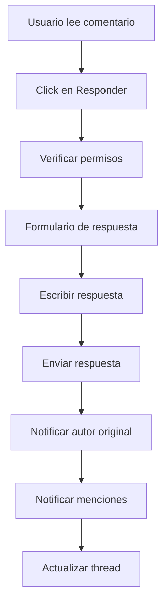
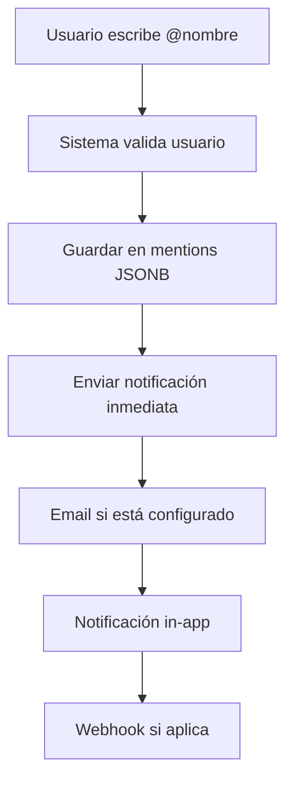
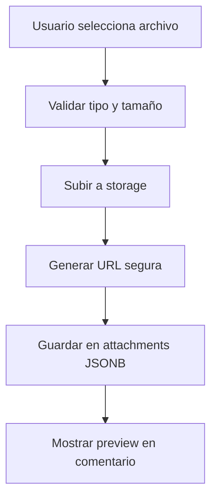
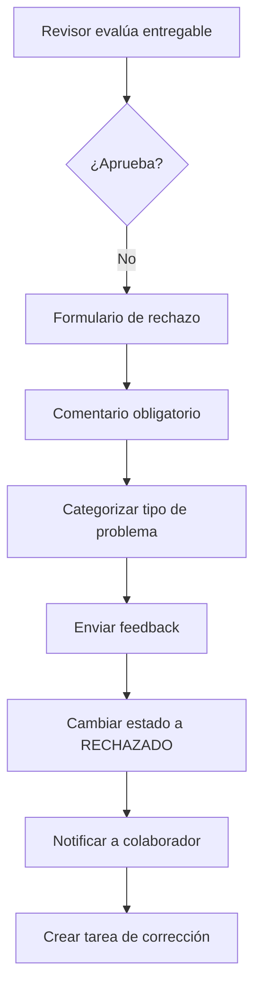

# Workflow - Comments & Feedback

Sistema integral de comentarios y feedback para facilitar la comunicación entre todos los actores del sistema.

## 💬 **Sistema de Comentarios General**

## 🔄 **Flujos por Tipo de Entidad**

### **Comentarios en Tareas**

#### **Flujo básico de comentarios en tareas**



#### **Tipos de comentarios en tareas**:

| Tipo | Quién puede | Cuándo | Notifica a |
|------|-------------|--------|------------|
| **GENERAL** | Todos los involucrados | Cualquier momento | Asignados + Admin |
| **FEEDBACK** | Admin, Cliente | En revisiones | Colaborador + Admin |
| **APPROVAL** | Admin, Cliente | Al aprobar | Colaborador + equipo |
| **REJECTION** | Admin, Cliente | Al rechazar (obligatorio) | Colaborador + Admin |

#### **Permisos por user_type**:

| User Type | Ver comentarios | Crear comentarios | Ver internos | Mencionar usuarios |
|-----------|----------------|-------------------|--------------|-------------------|
| **Cliente** | Solo sus proyectos | ✅ | ❌ | Solo su equipo |
| **Colaborador** | Tareas asignadas | ✅ | ✅ | Todo el equipo |
| **Admin** | Todos | ✅ | ✅ | Todos |
| **SuperAdmin** | Todos | ✅ | ✅ | Todos |

### **Comentarios en Proyectos**

#### **Comunicación a nivel proyecto**



#### **Casos de uso específicos**:
- **Actualizaciones de progreso** por Admin
- **Consultas del cliente** sobre el proyecto
- **Coordinación entre colaboradores**
- **Cambios de alcance o fechas**

### **Comentarios en Solicitudes (Requests)**

#### **Comunicación durante evaluación**



#### **Comentarios obligatorios**:
- **Al rechazar solicitud** → Razón específica
- **Al pedir más información** → Qué información falta
- **Al aprobar con condiciones** → Condiciones específicas

### **Comentarios en Entregables**

#### **Feedback específico por archivo**



## 🧵 **Sistema de Threading**

### **Conversaciones Anidadas**

#### **Estructura jerárquica**:
```
📝 Comentario principal (parent_comment_id = NULL)
  ↳ 💬 Respuesta 1 (parent_comment_id = comentario_principal.id)
    ↳ 💬 Respuesta a respuesta (parent_comment_id = respuesta_1.id)
  ↳ 💬 Respuesta 2 (parent_comment_id = comentario_principal.id)
```

#### **Límites de anidamiento**:
- **Máximo 3 niveles** de profundidad
- **Auto-colapso** de hilos largos (más de 5 respuestas)
- **Navegación visual** con indentación y líneas

### **Flujo de Respuestas**



## 👥 **Sistema de Menciones**

### **Menciones con @usuario**

#### **Funcionamiento**:
- **Autocompletado** al escribir `@` + primeras letras
- **Validación** de que el usuario tiene acceso a la entidad
- **Notificación inmediata** al usuario mencionado
- **Highlighting** del nombre en el comentario

#### **Reglas de menciones**:

```json
{
  "CLIENT": {
    "puede_mencionar": ["colaboradores_del_proyecto", "admin_del_proyecto"],
    "puede_ser_mencionado": true
  },
  "COLLABORATOR": {
    "puede_mencionar": ["equipo_completo", "cliente_del_proyecto"],
    "puede_ser_mencionado": true
  },
  "ADMIN": {
    "puede_mencionar": ["todos_los_usuarios"],
    "puede_ser_mencionado": true
  },
  "SUPERADMIN": {
    "puede_mencionar": ["todos_los_usuarios"],
    "puede_ser_mencionado": true
  }
}
```

### **Notificaciones por Menciones**



## 📎 **Archivos Adjuntos en Comentarios**

### **Soporte para Attachments**

#### **Tipos permitidos**:
- **Imágenes**: JPG, PNG, GIF (hasta 5MB)
- **Documentos**: PDF, DOC, TXT (hasta 10MB)
- **Enlaces**: URLs válidas con preview automático

#### **Flujo de subida**:



#### **Estructura de attachments**:
```json
{
  "attachments": [
    {
      "type": "image",
      "filename": "screenshot.png",
      "url": "https://storage.medialab/comments/abc123.png",
      "size": 1024000,
      "uploaded_at": "2024-01-15T10:30:00Z"
    },
    {
      "type": "link",
      "title": "Referencia de diseño",
      "url": "https://dribbble.com/shots/example",
      "preview_image": "https://cdn.dribbble.com/thumb.jpg"
    }
  ]
}
```

## ⚙️ **Integración con Flujo de Aprobaciones**

### **Comentarios Obligatorios en Rechazos**

#### **Flujo de rechazo con feedback**:



#### **Categorías de feedback**:
```json
{
  "categorias_rechazo": [
    {
      "code": "CALIDAD_TECNICA",
      "name": "Problemas de calidad técnica",
      "descripcion": "Audio, video, resolución, formato"
    },
    {
      "code": "CONTENIDO",
      "name": "Problemas de contenido",
      "descripcion": "Información incorrecta, falta contenido"
    },
    {
      "code": "ESPECIFICACIONES",
      "name": "No cumple especificaciones",
      "descripcion": "No sigue el brief o requerimientos"
    },
    {
      "code": "PRESENTACION",
      "name": "Problemas de presentación",
      "descripcion": "Formato, estilo, branding"
    }
  ]
}
```

### **Comentarios en Aprobaciones**

#### **Feedback positivo y sugerencias**:
- **Aprobación simple** → Comentario opcional
- **Aprobación con sugerencias** → Comentario con mejoras para futuro
- **Aprobación condicional** → Comentario con condiciones específicas

## 🔔 **Sistema de Notificaciones**

### **Triggers de Notificaciones**

#### **Eventos que generan notificaciones**:

| Evento | Notifica a | Tipo | Canal |
|--------|------------|------|-------|
| **Nuevo comentario** | Involucrados en la entidad | `COMMENT_ADDED` | In-app + Email |
| **Respuesta a comentario** | Autor del comentario padre | `COMMENT_REPLIED` | In-app + Email |
| **Mención en comentario** | Usuario mencionado | `COMMENT_MENTION` | In-app + Email |
| **Comentario editado** | Involucrados | `COMMENT_EDITED` | In-app |
| **Comentario resuelto** | Autor + involucrados | `COMMENT_RESOLVED` | In-app |

### **Configuración de Notificaciones**

#### **Preferencias por usuario**:
```json
{
  "comment_notifications": {
    "new_comments": {
      "email": true,
      "in_app": true,
      "immediate": true
    },
    "mentions": {
      "email": true,
      "in_app": true,
      "immediate": true
    },
    "replies": {
      "email": false,
      "in_app": true,
      "immediate": false
    }
  }
}
```

## 📊 **Métricas y Analytics**

### **KPIs de Comunicación**

#### **Por usuario**:
- **Tiempo promedio de respuesta** a comentarios
- **Tasa de resolución** de feedback
- **Calidad de feedback** (rating por receptores)
- **Participación en conversaciones**

#### **Por proyecto**:
- **Número de comentarios** por fase
- **Tiempo de resolución** de issues planteados
- **Satisfacción con comunicación** (surveys)

### **Dashboard de Comentarios**

#### **Métricas en tiempo real**:
- **Comentarios pendientes de respuesta** por usuario
- **Threads más activos** de la semana
- **Tiempo promedio de resolución** por tipo de feedback
- **Usuarios más activos** en comentarios

## 🔧 **Configuraciones del Sistema**

### **Configuraciones Críticas** (tabla `configurations`)

| Key | Value | Descripción |
|-----|-------|-------------|
| `comments.max_length` | 2000 | Máximo caracteres por comentario |
| `comments.max_attachments` | 3 | Máximo archivos por comentario |
| `comments.edit_time_limit` | 30 | Minutos para editar comentario |
| `comments.threading_max_depth` | 3 | Máximo niveles de anidamiento |
| `comments.auto_resolve_days` | 7 | Días para auto-resolver comentarios |
| `comments.mention_notification_delay` | 0 | Delay en segundos para notificaciones |

### **Moderación y Control**

#### **Sistema de moderación**:
- **Auto-moderación** por palabras clave
- **Reportes de usuarios** por contenido inapropiado
- **Soft delete** con posibilidad de recuperación
- **Historial de ediciones** para auditoría

## 🔄 **Integración con Otros Workflows**

### **Con Workflow Projects-Tasks**

#### **Comentarios automáticos del sistema**:
```json
{
  "system_comments": [
    {
      "trigger": "task_status_changed",
      "template": "Estado cambiado de {old_status} a {new_status} por {user_name}",
      "type": "SYSTEM",
      "auto_create": true
    },
    {
      "trigger": "task_assigned",
      "template": "Tarea asignada a {assignee_name} por {admin_name}",
      "type": "SYSTEM",
      "auto_create": true
    },
    {
      "trigger": "deliverable_uploaded",
      "template": "Nuevo entregable subido: {filename}",
      "type": "SYSTEM",
      "auto_create": true
    }
  ]
}
```

### **Con Workflow Users**

#### **Gestión de comentarios de ex-empleados**:
- **Preservar comentarios** históricos
- **Marcar como ex-empleado** en la visualización
- **Impedir nuevos comentarios** de usuarios desactivados
- **Reasignar ownership** de threads críticos

### **Con Workflow Inventory**

#### **Comentarios en equipos**:
- **Reportes de problemas** directamente en comentarios
- **Historial de mantenimiento** con feedback técnico
- **Comunicación durante reservas** de equipos críticos

## 🚀 **Características Avanzadas**

### **Templates de Comentarios**

#### **Plantillas predefinidas para feedback común**:
```json
{
  "feedback_templates": [
    {
      "name": "Calidad de video",
      "category": "TECNICO",
      "template": "La calidad del video necesita mejoras en:\n- [ ] Resolución\n- [ ] Estabilización\n- [ ] Iluminación\n- [ ] Audio\n\nComentarios específicos:\n{comentario_personalizado}"
    },
    {
      "name": "Aprobación con cambios menores",
      "category": "APROBACION",
      "template": "Excelente trabajo! Aprobado con estos cambios menores:\n{lista_cambios}\n\nPara futuros proyectos considerar:\n{sugerencias_futuro}"
    }
  ]
}
```

### **Rich Text Editor**

#### **Funcionalidades avanzadas**:
- **Formato básico** (bold, italic, lists)
- **Menciones automáticas** con @
- **Links automáticos** con preview
- **Código inline** para feedback técnico
- **Emojis** para comunicación más amigable

### **Historial y Auditoría**

#### **Tracking completo**:
- **Todas las ediciones** con timestamp
- **Razón de edición** (opcional)
- **IP y dispositivo** de cada comentario
- **Tiempo de lectura** por usuario

---

**Relacionado con**:
- [Workflow Projects-Tasks](/documentacion-tecnica/workflows/workflow-projects-tasks) - Para comentarios en tareas y proyectos
- [Workflow Users](/documentacion-tecnica/workflows/workflow-users) - Para permisos y menciones de usuarios
- [Workflow Inventory](/documentacion-tecnica/workflows/workflow-inventory) - Para feedback en equipos