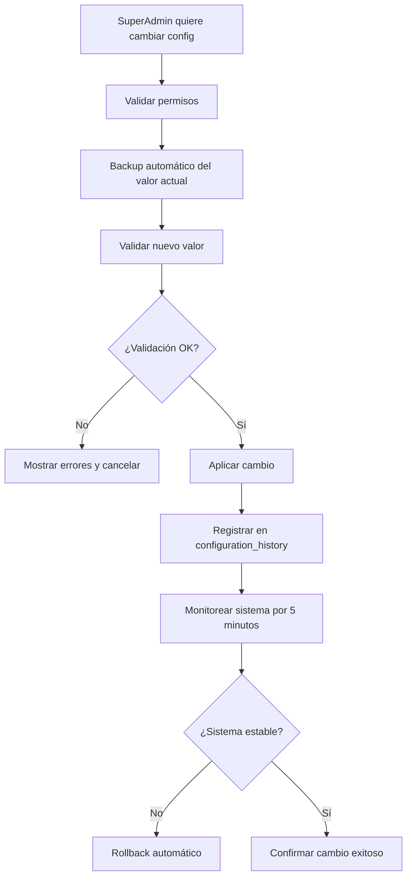
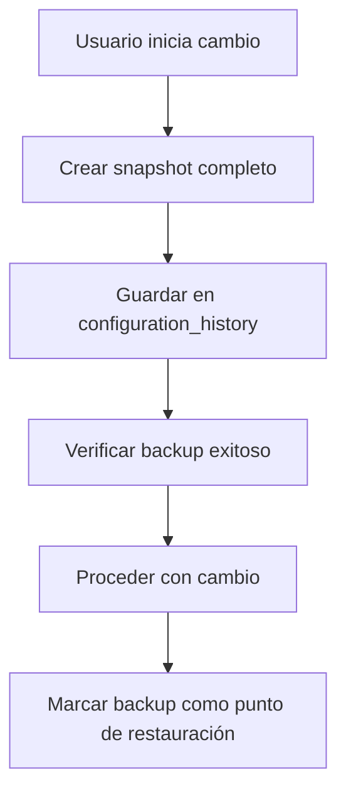
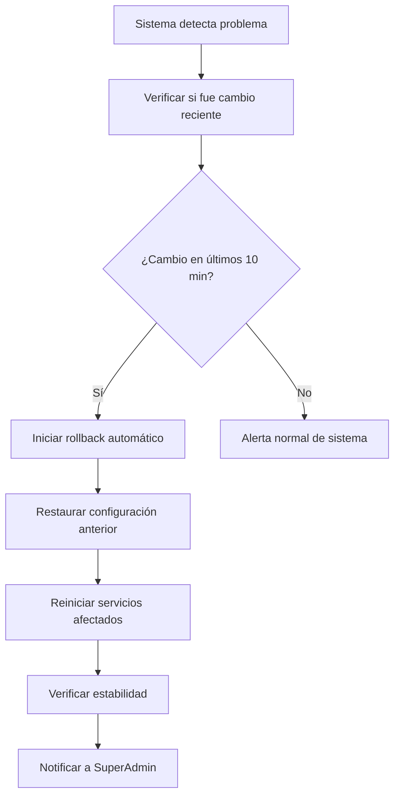

# Workflow - Configuration

Sistema de gestión de configuraciones del sistema con backup automático, validaciones y capacidad de rollback para cambios críticos.

## ⚙️ **Concepto General de Configuración**

### **Principio Básico**
**Nada hardcodeado** - Todo configurable desde la base de datos con **backup automático**, **validaciones estrictas** y **rollback inmediato** si algo sale mal.

### **Flujo Principal de Cambio de Configuración**

## 🔧 **Tipos de Configuraciones**

### **Por Criticidad**

#### **Críticas (Nivel 1)**
Pueden **romper el sistema** si se configuran mal:
- **Configuraciones de base de datos** (conexiones, pools)
- **URLs de servicios externos** críticos
- **Configuraciones de seguridad** (JWT secrets, encryption keys)
- **Límites de sistema** (memory, connections)

**Características**:
- Requieren **confirmación doble**
- **Backup automático** antes del cambio
- **Monitoreo automático** post-cambio
- **Rollback automático** si detecta problemas

#### **Importantes (Nivel 2)**
Afectan **funcionalidad principal**:
- **Timeouts de workflows** (evaluación, revisión, etc.)
- **Límites de usuarios** (archivos, sesiones)
- **Configuraciones de notificaciones**
- **Estados y flujos** de trabajo

**Características**:
- Requieren **justificación** del cambio
- **Backup automático**
- **Validación estricta** de valores
- **Rollback manual** disponible

#### **Normales (Nivel 3)**
Afectan **experiencia de usuario**:
- **Colores e iconos** del sistema
- **Textos de interfaz**
- **Configuraciones de reportes**
- **Preferencias por defecto**

**Características**:
- **Validación básica**
- **Historial** de cambios
- **Rollback** disponible por 30 días

#### **Cosmética (Nivel 4)**
Solo afectan **apariencia**:
- **Logos e imágenes**
- **Colores secundarios**
- **Textos informativos**

**Características**:
- **Cambio inmediato**
- **Historial básico**

## 🛡️ **Sistema de Validaciones**

### **Validaciones por Tipo de Dato**

#### **URLs y Endpoints**
- **Formato válido**: Protocolo, dominio, puerto
- **Accesibilidad**: Ping básico para verificar conexión
- **Certificados SSL**: Validar si es HTTPS
- **Timeout test**: Verificar que responde en tiempo razonable

#### **Números y Límites**
- **Rangos válidos**: Min/max según el contexto
- **Tipo correcto**: Integer, float, etc.
- **Dependencias**: Que sea coherente con otros valores
- **Performance**: Que no afecte rendimiento del sistema

#### **Textos y Strings**
- **Longitud**: Min/max caracteres
- **Caracteres permitidos**: No scripts maliciosos
- **Encoding**: UTF-8 válido
- **Contexto**: Apropiado para su uso

#### **Configuraciones de Tiempo**
- **Formato válido**: Días, horas, minutos
- **Rangos lógicos**: No negativos, no excesivamente largos
- **Coherencia**: Entre timeouts relacionados
- **Zona horaria**: Consistencia en el sistema

### **Validaciones de Dependencias**

#### **Configuraciones Relacionadas**
- **Timeout de revisión** no puede ser mayor que **timeout de proyecto**
- **Límite de archivos** debe ser coherente con **límite de storage**
- **Configuraciones de email** deben tener **servidor SMTP** válido

#### **Validaciones de Negocio**
- **Estados de workflow** deben mantener **flujo lógico**
- **Roles de usuario** deben tener **permisos coherentes**
- **Tipos de servicio** deben tener **categorías válidas**

## 📦 **Sistema de Backup y Historial**

### **Backup Automático**

#### **Antes de Cada Cambio**

#### **Información del Backup**
- **Timestamp exacto** del backup
- **Usuario** que realizó el cambio
- **Valor anterior** completo
- **Razón del cambio** (opcional pero recomendado)
- **Estado del sistema** en ese momento

### **Historial Completo**

#### **Para Cada Cambio se Registra**
- **Quién**: Usuario que hizo el cambio
- **Qué**: Configuración específica modificada
- **Cuándo**: Timestamp exacto
- **Desde/Hasta**: Valor anterior y nuevo
- **Por qué**: Razón del cambio
- **Cómo**: Interfaz usada (Web UI, API, etc.)

#### **Metadatos Adicionales**
- **IP y dispositivo** desde donde se hizo
- **Tiempo de aplicación** del cambio
- **Validaciones ejecutadas** y resultados
- **Estado post-cambio** del sistema

## 🔄 **Sistema de Rollback**

### **Rollback Automático**

#### **Triggers para Rollback Automático**
- **Error 500** en endpoints críticos por más de 2 minutos
- **Base de datos** no responde en 30 segundos
- **Servicios externos** fallan por timeout configurado
- **Memoria o CPU** por encima del 95% por 5 minutos

#### **Proceso Automático**

### **Rollback Manual**

#### **Rollback con Un Click**
- **Interfaz simple**: Lista de cambios recientes con botón "Deshacer"
- **Vista previa**: Qué va a cambiar exactamente
- **Confirmación**: "¿Estás seguro?" con detalles del impacto
- **Ejecución**: Aplicación inmediata con monitoreo

#### **Rollback Selectivo**
- **Cambios múltiples**: Poder elegir cuáles deshacer
- **Configuraciones relacionadas**: Advertir sobre dependencias
- **Vista de diferencias**: Before/after claro
- **Simulación**: Dry-run antes de aplicar

### **Rollback de Emergencia**

#### **Para Situaciones Críticas**
- **Botón de pánico**: Rollback a último estado estable conocido
- **Sin confirmaciones**: Acción inmediata
- **Notificación masiva**: A todo el equipo técnico
- **Log crítico**: Registro especial del evento

## 🔍 **Monitoreo Post-Cambio**

### **Monitoreo Automático**

#### **Métricas Monitoreadas**
- **Tiempo de respuesta** de endpoints críticos
- **Errores 4xx y 5xx** en API
- **Uso de memoria y CPU** del servidor
- **Conexiones a base de datos** activas
- **Logs de error** del sistema

#### **Umbrales de Alerta**
- **Tiempo de respuesta** mayor a 3 segundos
- **Tasa de errores** mayor al 5%
- **Uso de memoria** mayor al 85%
- **Errores en logs** más de 10 en 5 minutos

### **Períodos de Monitoreo**

#### **Críticas**: 30 minutos de monitoreo intensivo
- Verificación cada 30 segundos
- Rollback automático si detecta problemas
- Alerta inmediata a SuperAdmin

#### **Importantes**: 10 minutos de monitoreo
- Verificación cada 2 minutos
- Alerta si detecta problemas
- Rollback manual disponible

#### **Normales**: 5 minutos de verificación
- Verificación cada 5 minutos
- Log si detecta problemas menores

## 👥 **Permisos y Roles**

### **SuperAdmin**
- **Acceso completo** a todas las configuraciones
- **Puede hacer rollback** de cualquier cambio
- **Recibe alertas** de todos los problemas
- **Puede configurar** niveles de criticidad

### **Admin**
- **Solo configuraciones Nivel 3 y 4** (normales y cosmética)
- **Puede ver historial** de cambios
- **Puede sugerir cambios** críticos (requieren aprobación)
- **No puede hacer rollback** de cambios críticos

### **Colaborador y Cliente**
- **Solo pueden ver** configuraciones que les afectan
- **Pueden sugerir mejoras** a través de feedback
- **No pueden modificar** ninguna configuración del sistema

## 📊 **Reportes y Análisis**

### **Dashboard de Configuraciones**

#### **Para SuperAdmin**
- **Cambios recientes** con estado de monitoreo
- **Configuraciones críticas** y su estado actual
- **Alertas activas** del sistema
- **Uso de rollbacks** en el último mes

#### **Métricas Importantes**
- **Tiempo promedio** entre cambio y estabilidad confirmada
- **Porcentaje de rollbacks** automáticos vs manuales
- **Configuraciones más cambiadas** en el último período
- **Usuarios más activos** haciendo cambios

### **Reportes de Auditoria**

#### **Reporte Mensual**
- **Todos los cambios** realizados en el mes
- **Rollbacks ejecutados** y sus razones
- **Tiempo de inactividad** causado por cambios
- **Recomendaciones** para mejorar estabilidad

#### **Reporte de Incidentes**
- **Cambios que causaron problemas**
- **Tiempo de detección** y resolución
- **Lecciones aprendidas**
- **Mejoras implementadas** en validaciones

## 🔄 **Integración con Otros Workflows**

### **Con Security & Audit**
- **Todos los cambios** se registran en audit_logs
- **Cambios críticos** generan alertas de seguridad
- **Rollbacks** se auditan con máxima prioridad
- **Accesos no autorizados** a configuraciones se bloquean

### **Con Notifications**
- **Cambios críticos** notifican a SuperAdmin inmediatamente
- **Rollbacks automáticos** generan alertas críticas
- **Problemas post-cambio** escalan automáticamente
- **Configuraciones de notificación** son parte del sistema

### **Con Users**
- **Permisos de configuración** se basan en user_type
- **Cambios de usuarios** pueden requerir ajustes de configuración
- **Historial de cambios** se relaciona con usuarios específicos

## 🚀 **Casos Especiales**

### **Deploy de Nueva Versión**
- **Backup completo** de todas las configuraciones antes del deploy
- **Validación extendida** de configuraciones después del deploy
- **Plan de rollback** específico para versiones
- **Configuraciones nuevas** con valores por defecto seguros

### **Migraciones de Datos**
- **Configuraciones relacionadas** con estructura de datos
- **Backup especial** antes de migraciones complejas
- **Validación post-migración** de configuraciones
- **Rollback coordinado** de datos y configuraciones

### **Mantenimiento Programado**
- **Configuraciones temporales** para modo mantenimiento
- **Rollback automático** después del mantenimiento
- **Notificaciones especiales** durante mantenimiento
- **Validación completa** del sistema post-mantenimiento

## ⚙️ **Configuraciones del Propio Sistema de Configuración**

### **Meta-configuraciones**
- **Tiempo de monitoreo** post-cambio por nivel
- **Umbrales de alerta** para rollback automático
- **Retención de historial** (cuánto tiempo mantener backups)
- **Notificaciones** del sistema de configuración

### **Configuraciones de Seguridad**
- **Quién puede cambiar** cada nivel de configuración
- **Validaciones adicionales** requeridas
- **Confirmaciones múltiples** para cambios críticos
- **Logs especiales** para cambios de seguridad

---

**Relacionado con**:
- [Workflow Security & Audit](/documentacion-tecnica/workflows/workflow-security-audit) - Para auditoría de cambios de configuración
- [Workflow Notifications](/documentacion-tecnica/workflows/workflow-notifications) - Para alertas de cambios críticos
- [Workflow Users](/documentacion-tecnica/workflows/workflow-users) - Para permisos de configuración por tipo de usuario