# Workflow - Inventory

Documentación completa de todos los flujos relacionados con gestión de inventario, desde adquisición hasta mantenimiento.

## 📦 **Flujo de Gestión de Equipos**

### **Fase 1: Registro de Nuevo Equipo**

#### **Trigger**: Llegada de equipo nuevo o registro de existente

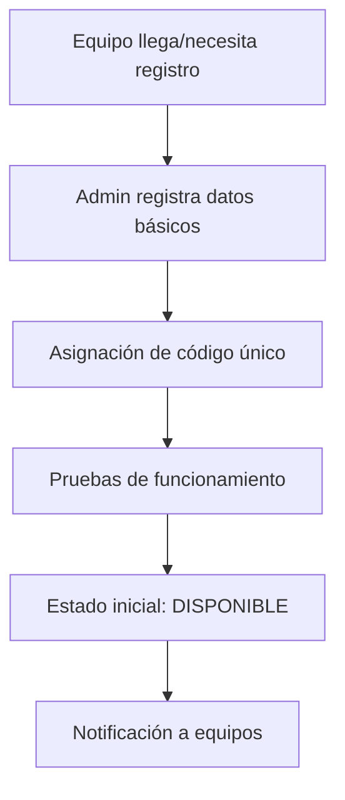

**Datos requeridos**:
- `inventory_type_id` - Tipo de equipo (CAMARA, AUDIO, ILUMINACION, etc.)
- `name` - Nombre descriptivo del equipo
- `service_tag` - Etiqueta de servicio (si aplica)
- `serial_number` - Número de serie del fabricante
- `location` - Ubicación física actual
- `observations` - Estado inicial y características especiales

**Auto-generación**:
- `equipment_number` - Número correlativo automático por tipo
- `ug_code` - Código interno de la universidad (si aplica)

#### **Validaciones iniciales**:
- ✅ Serial number no existe previamente
- ✅ Service tag único (si se proporciona)
- ✅ Tipo de inventario está activo
- ✅ Ubicación es válida

### **Fase 2: Asignación Permanente (Opcional)**

#### **Equipos asignados a usuario específico**

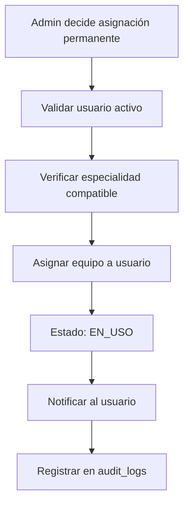

**Criterios para asignación permanente**:
- **Laptop personal** → Un colaborador específico
- **Cámara especializada** → Camarógrafo principal
- **Kit de audio** → Editor de audio dedicado
- **Herramientas de diseño** → Diseñador específico

**Restricciones**:
- ✅ Usuario debe tener especialidad compatible
- ✅ Usuario debe estar activo (no en licencia)
- ✅ Equipo debe estar DISPONIBLE
- ✅ Solo Admin/SuperAdmin puede asignar permanentemente

## 🔄 **Flujo de Reserva para Tareas**

### **Reserva Manual por Admin**

#### **Admin asigna equipo a tarea específica**

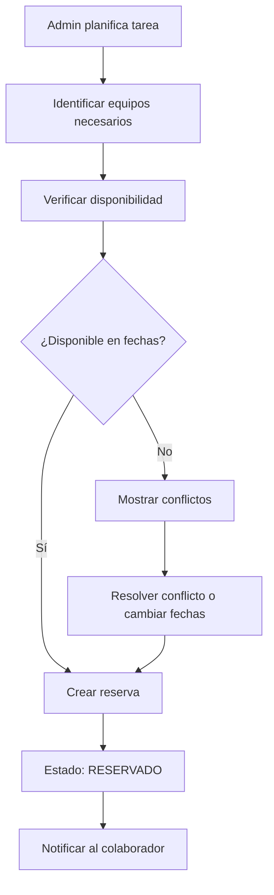

**Datos de la reserva** (`task_equipment`):
- `task_id` - Tarea que necesita el equipo
- `equipment_id` - Equipo específico reservado
- `reserved_from` - Fecha/hora de inicio
- `reserved_to` - Fecha/hora de fin
- `status_id` - Estado de la reserva (RESERVADO)

### **Detección de Conflictos**

#### **Validaciones automáticas antes de reservar**:

```sql
-- Verificar si equipo está disponible en rango de fechas
SELECT COUNT(*) FROM task_equipment te
JOIN status_options so ON te.status_id = so.id
WHERE te.equipment_id = ? 
  AND so.code IN ('RESERVADO', 'EN_USO')
  AND (
    (te.reserved_from <= ? AND te.reserved_to > ?) OR
    (te.reserved_from < ? AND te.reserved_to >= ?) OR
    (te.reserved_from >= ? AND te.reserved_to <= ?)
  )
```

#### **Tipos de conflictos**:

| Tipo de Conflicto | Descripción | Resolución |
|-------------------|-------------|------------|
| **Solapamiento Total** | Equipo ocupado todo el periodo | Cambiar fechas o equipo |
| **Solapamiento Parcial** | Equipo ocupado parte del periodo | Ajustar horarios |
| **Equipo en Mantenimiento** | No disponible por reparación | Usar equipo alternativo |
| **Asignación Permanente** | Equipo asignado a otro usuario | Coordinar con usuario |

### **Resolución Automática de Conflictos**

#### **Estrategias de resolución**:

1. **Sugerir equipos alternativos** del mismo tipo
2. **Proponer ajuste de horarios** para evitar solapamiento
3. **Mostrar equipos disponibles** en fechas cercanas
4. **Alertar sobre mantenimientos** programados

## ⏰ **Flujo de Check-out y Check-in**

### **Check-out: Entrega de Equipo**

#### **Colaborador recoge equipo para usar en tarea**

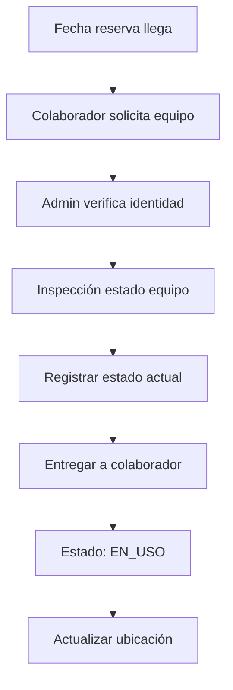

**Proceso de check-out**:
1. **Verificación de reserva** → Confirmar que colaborador tiene reserva activa
2. **Inspección visual** → Documentar estado actual del equipo
3. **Registro de entrega** → Timestamp, usuario, estado observado
4. **Entrega física** → Colaborador firma recepción (opcional)
5. **Actualización de sistema** → Estado EN_USO, nueva ubicación

**Documentación requerida**:
- Estado físico del equipo (rayones, funcionamiento)
- Accesorios incluidos (cables, baterías, estuches)
- Ubicación donde se usará
- Fecha estimada de devolución

### **Check-in: Devolución de Equipo**

#### **Colaborador devuelve equipo después de usar**

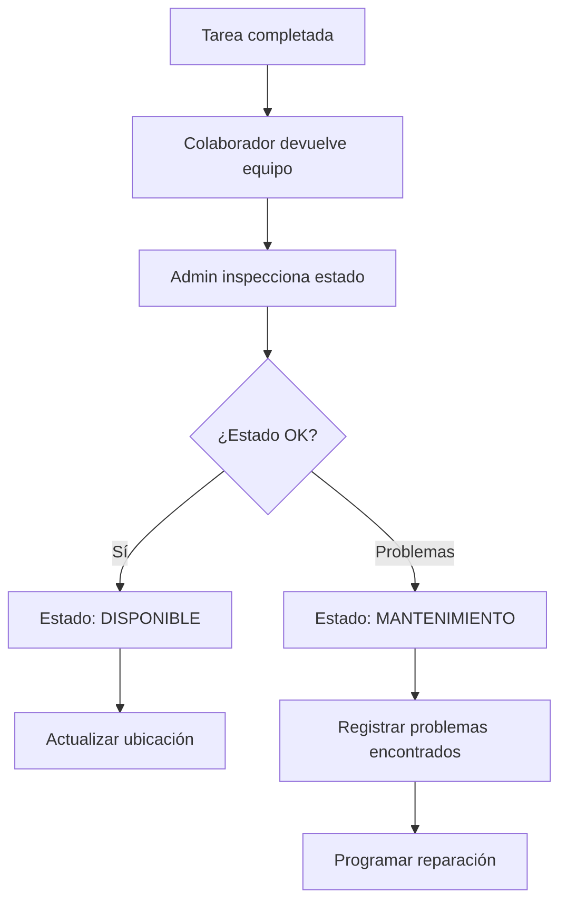

**Validaciones en devolución**:
- ✅ Integridad física del equipo
- ✅ Funcionamiento básico
- ✅ Accesorios completos
- ✅ Limpieza y cuidado general

#### **Casos especiales en devolución**:

**Equipo dañado**:
- Estado automático: `REPARACION`
- Registro detallado del daño
- Asignación de responsabilidad (si aplica)
- Estimación de costo de reparación

**Equipo perdido**:
- Estado: `PERDIDO` (nuevo estado)
- Proceso disciplinario si es responsabilidad del usuario
- Reporte a seguros (si aplica)
- Replacement planning

**Devolución tardía**:
- Notificación automática +1 día de retraso
- Escalamiento a Admin +3 días
- Posible penalización en futuras asignaciones

## 🔧 **Flujo de Mantenimiento**

### **Mantenimiento Preventivo**

#### **Programación automática basada en uso**

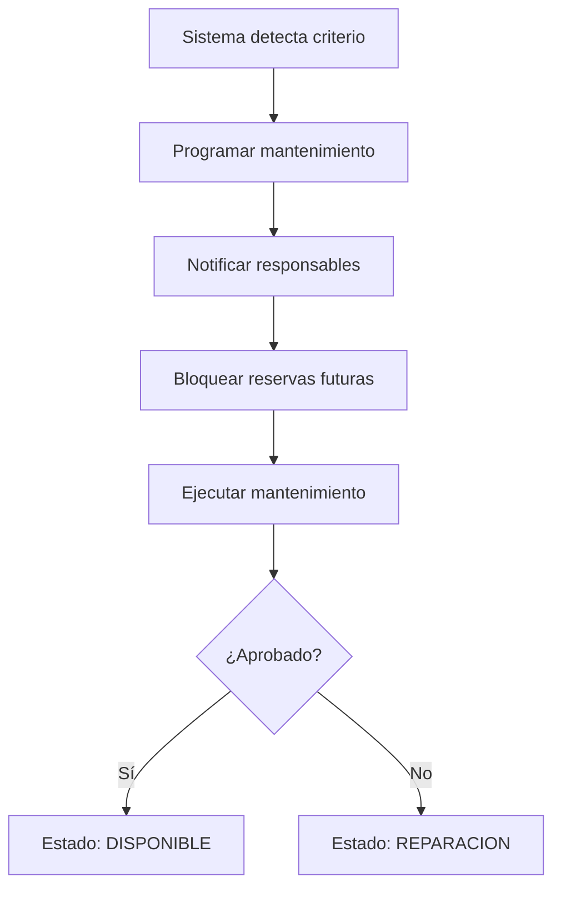

**Criterios para mantenimiento preventivo**:
- **Por tiempo**: Cada 6 meses para cámaras profesionales
- **Por uso**: Cada 100 horas de grabación para equipos de video
- **Por proyectos**: Cada 20 proyectos para equipos críticos
- **Por fecha**: Mantenimiento anual obligatorio

#### **Proceso de mantenimiento**:
1. **Planificación** → Identificar ventana de tiempo sin reservas
2. **Notificación** → Avisar a usuarios frecuentes del equipo
3. **Bloqueo temporal** → Impedir nuevas reservas durante mantenimiento
4. **Ejecución** → Limpieza, calibración, actualización firmware
5. **Pruebas** → Verificar funcionamiento completo
6. **Documentación** → Registrar trabajos realizados

### **Mantenimiento Correctivo**

#### **Equipo reportado con problemas**

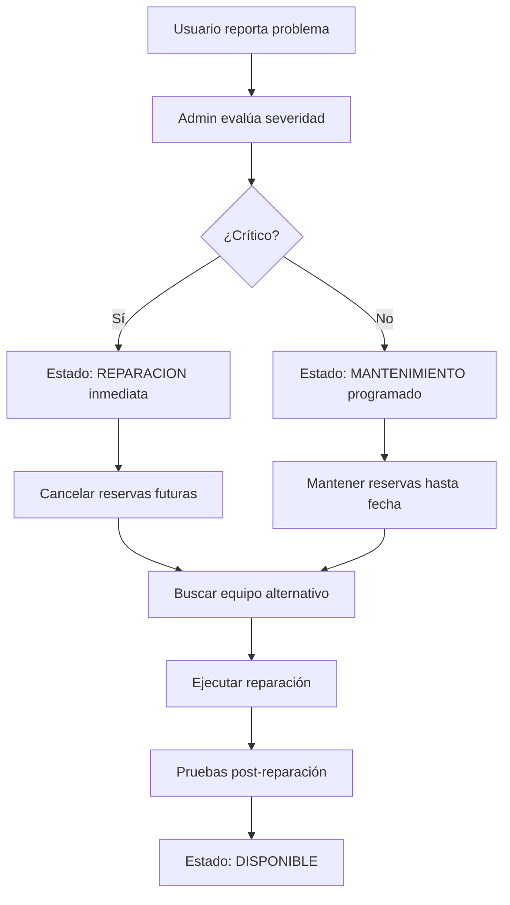

**Clasificación de problemas**:

| Severidad | Descripción | Tiempo de Respuesta |
|-----------|-------------|-------------------|
| **Crítico** | Equipo no funciona | Inmediato |
| **Alto** | Funcionalidad reducida | 24 horas |
| **Medio** | Problemas menores | 1 semana |
| **Bajo** | Mantenimiento cosmético | Próximo ciclo |

## 📋 **Flujo de Gestión de Suministros**

### **Control de Stock**

#### **Recepción de nuevos suministros**

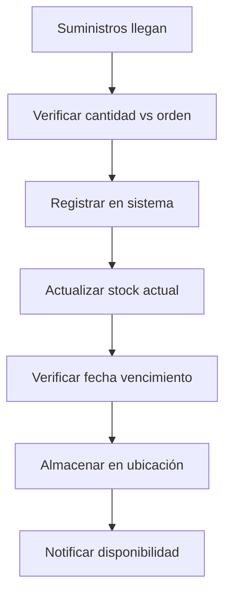

**Datos registrados** (`supplies`):
- `shipment_number` - Número de envío del proveedor
- `received_date` - Fecha de recepción
- `received_by` - Quien recibió el envío
- `received_quantity` - Cantidad real recibida
- `product_name` - Nombre del producto
- `presentation` - Presentación (unidad, caja, etc.)

### **Entrega de Suministros**

#### **Colaborador solicita suministros para proyecto**

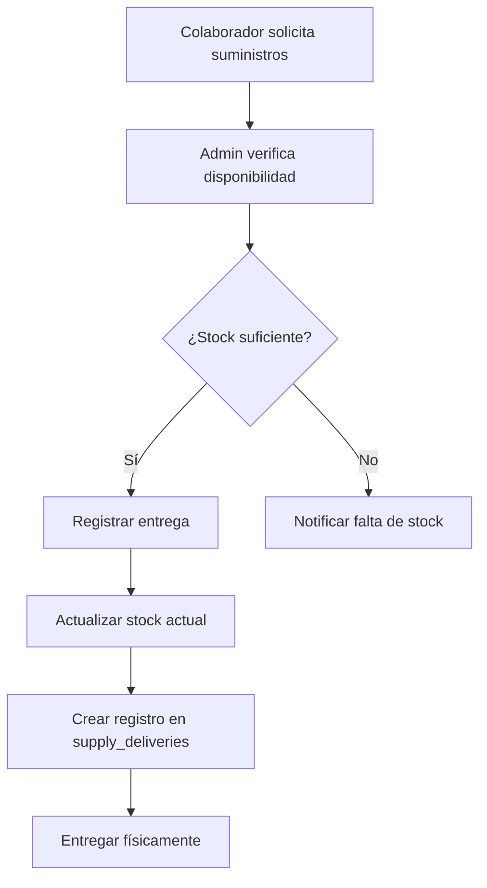

**Control de entregas** (`supply_deliveries`):
- `delivered_to` - A quién se entrega
- `quantity_delivered` - Cantidad entregada
- `delivery_date` - Fecha de entrega
- `notes` - Propósito o proyecto específico

#### **Alertas automáticas de stock**:
- 🟡 **Stock bajo**: Cuando queda menos del 20% del stock normal
- 🔴 **Stock crítico**: Cuando queda menos del 5% del stock normal
- ⚫ **Sin stock**: Cuando current_stock = 0

## 🔍 **Flujo de Búsqueda y Disponibilidad**

### **Consulta de Disponibilidad por Fechas**

#### **Admin busca equipos disponibles para rango específico**

```sql
-- Query para encontrar equipos disponibles
SELECT e.*, it.name as type_name
FROM equipment e
JOIN inventory_types it ON e.inventory_type_id = it.id
JOIN status_options so ON e.status_id = so.id
WHERE so.code = 'DISPONIBLE'
  AND e.is_active = true
  AND e.id NOT IN (
    SELECT te.equipment_id 
    FROM task_equipment te
    JOIN status_options so2 ON te.status_id = so2.id
    WHERE so2.code IN ('RESERVADO', 'EN_USO')
      AND te.reserved_from <= ?
      AND te.reserved_to > ?
  )
```

### **Búsqueda por Especialidad**

#### **Matching automático equipo-colaborador**

```json
{
  "service_type": "VIDEO_PROMOCIONAL",
  "required_equipment": [
    {"type": "CAMARA", "quantity": 2, "characteristics": ["4K", "stabilization"]},
    {"type": "AUDIO", "quantity": 1, "characteristics": ["lavalier", "wireless"]},
    {"type": "ILUMINACION", "quantity": 3, "characteristics": ["LED", "portable"]}
  ],
  "preferred_collaborators": [
    {"role": "CAMAROGRAFO", "specialties": ["video_4k", "stabilization"]},
    {"role": "TECNICO", "specialties": ["audio_recording", "lighting_setup"]}
  ]
}
```

## 📊 **Flujo de Reportes de Inventario**

### **Reportes Automáticos**

#### **Reporte de utilización semanal**

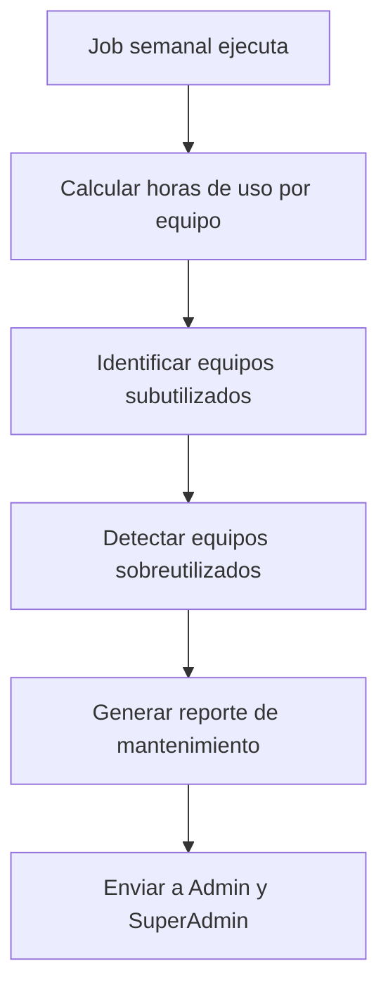

**Métricas calculadas**:
- **Horas de uso por equipo** por semana/mes
- **Porcentaje de utilización** vs capacidad total
- **Equipos más/menos utilizados**
- **Tiempo promedio** entre reservas
- **Eficiencia de mantenimiento** (tiempo fuera de servicio)

#### **Alertas proactivas**:

| Métrica | Umbral | Acción |
|---------|--------|--------|
| Utilización mayor al 90% | Semanal | Considerar adquisición de backup |
| Utilización menor al 10% | Mensual | Evaluar necesidad del equipo |
| Tiempo en reparación mayor a 30 días | Inmediato | Escalar a decisión de reemplazo |
| Mantenimientos vencidos | Diario | Programar mantenimiento urgente |

### **Dashboard de Inventario en Tiempo Real**

#### **Widgets críticos para Admin**:
- **Estado actual de todos los equipos** (gráfico de torta)
- **Reservas de hoy y mañana** (calendario compacto)
- **Equipos vencidos para devolución** (lista de alertas)
- **Stock bajo de suministros** (tabla con alertas)
- **Mantenimientos pendientes** (lista priorizada)

## 🚨 **Flujo de Emergencias y Excepciones**

### **Equipo Necesario Urgentemente**

#### **Proyecto urgente necesita equipo ya reservado**

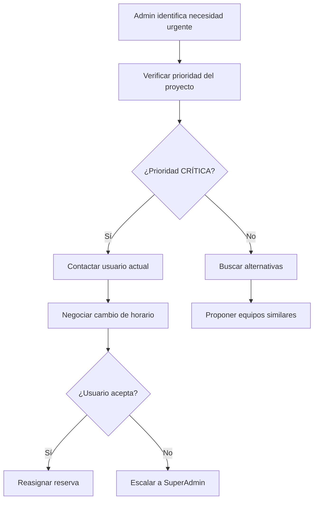

**Criterios para override de emergencia**:
- ✅ Proyecto marcado como CRÍTICO por SuperAdmin
- ✅ Cliente de alta prioridad (rector, vicerector)
- ✅ Evento con fecha inamovible (graduación, conferencia)
- ✅ Emergencia institucional (crisis de comunicación)

#### **Proceso de compensación**:
1. **Reasignación temporal** → Ofrecer equipo equivalente o superior
2. **Prioridad futura** → Usuario afectado tiene prioridad en próximas reservas
3. **Notificación transparente** → Explicar razón del cambio
4. **Documentación** → Registrar en audit_logs con justificación

### **Equipo Dañado Durante Uso**

#### **Colaborador reporta daño durante proyecto**

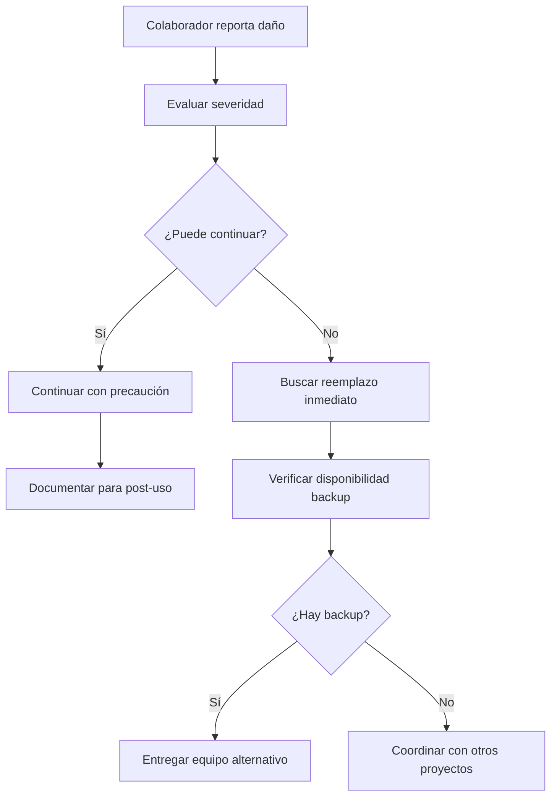

**Equipos críticos con backup obligatorio**:
- **Cámara principal** → Siempre tener 1 backup disponible
- **Sistema de audio** → Backup para grabaciones importantes
- **Computadora de edición** → Estación alternativa disponible

## ⚙️ **Configuraciones de Inventario**

### **Configuraciones Críticas** (tabla `configurations`)

| Key | Value | Descripción |
|-----|-------|-------------|
| `inventory.checkout.max_duration_days` | 7 | Máximo días que se puede tener equipo |
| `inventory.maintenance.preventive_hours` | 100 | Horas de uso para mantenimiento preventivo |
| `inventory.alerts.stock_low_percentage` | 20 | Porcentaje para alerta de stock bajo |
| `inventory.alerts.overdue_hours` | 24 | Horas de retraso para alerta |
| `inventory.backup.critical_equipment` | true | Mantener backup de equipos críticos |
| `inventory.auto_release.inactive_days` | 3 | Días para liberar reservas no reclamadas |

### **Estados Especiales de Equipos**

#### **Estados adicionales para casos específicos**:

| Estado | Código | Uso | Duración |
|--------|--------|-----|----------|
| **PERDIDO** | LOST | Equipo extraviado | Hasta encontrar o declarar pérdida total |
| **ROBADO** | STOLEN | Equipo sustraído | Hasta resolución legal |
| **OBSOLETO** | OBSOLETE | Equipo muy antiguo | Previo a retiro definitivo |
| **EN_TRANSITO** | IN_TRANSIT | Equipo siendo movido | Máximo 24 horas |

### **Roles y Permisos en Inventario**

#### **Matriz de permisos por user_type**:

| Acción | Cliente | Colaborador | Admin | SuperAdmin |
|--------|---------|-------------|-------|------------|
| **Ver disponibilidad** | ❌ | ✅ | ✅ | ✅ |
| **Reservar equipo** | ❌ | ⚠️ | ✅ | ✅ |
| **Check-out equipo** | ❌ | ✅ | ✅ | ✅ |
| **Reportar problemas** | ❌ | ✅ | ✅ | ✅ |
| **Aprobar mantenimiento** | ❌ | ❌ | ✅ | ✅ |
| **Asignar permanentemente** | ❌ | ❌ | ✅ | ✅ |
| **Crear/editar equipos** | ❌ | ❌ | ✅ | ✅ |
| **Dar de baja equipos** | ❌ | ❌ | ❌ | ✅ |

**⚠️ Colaborador puede reservar** solo si:
- ✅ Tiene tarea asignada que requiere el equipo
- ✅ Reserva es para máximo 2 días en el futuro
- ✅ No tiene equipos vencidos sin devolver

## 🔄 **Integración con Otros Flujos**

### **Con Workflow Projects-Tasks**

#### **Reserva automática basada en tipo de tarea**:

```json
{
  "task_type": "VIDEO_PROMOCIONAL",
  "auto_reserve_equipment": [
    {"type": "CAMARA", "quantity": 1, "duration_hours": 8},
    {"type": "AUDIO", "quantity": 1, "duration_hours": 8},
    {"type": "ILUMINACION", "quantity": 2, "duration_hours": 6}
  ],
  "suggested_collaborators": [
    {"role": "CAMAROGRAFO", "priority": 1},
    {"role": "TECNICO", "priority": 2}
  ]
}
```

### **Con Workflow Users**

#### **Liberación automática en cambio de estado de usuario**:

```sql
-- Trigger cuando usuario pasa a LICENCIA o EX_EMPLEADO
UPDATE equipment 
SET assigned_to_user_id = NULL, status_id = (SELECT id FROM status_options WHERE code = 'DISPONIBLE')
WHERE assigned_to_user_id = ? AND assigned_to_user_id IS NOT NULL;

-- Cancelar reservas futuras
UPDATE task_equipment 
SET status_id = (SELECT id FROM status_options WHERE code = 'CANCELADO')
WHERE equipment_id IN (SELECT id FROM equipment WHERE assigned_to_user_id = ?)
  AND reserved_from > NOW();
```

## 📈 **Métricas y KPIs de Inventario**

### **KPIs Operacionales**

#### **Eficiencia de utilización**:
- **Utilización promedio** por tipo de equipo
- **Tiempo de inactividad** por mantenimiento
- **Porcentaje de reservas completadas** vs canceladas
- **Tiempo promedio** de check-out a check-in

#### **KPIs de servicio**:
- **Disponibilidad cuando se necesita** (porcentaje de veces que hay equipo disponible)
- **Tiempo de respuesta** para mantenimiento correctivo
- **Porcentaje de equipos en buen estado** (sin problemas reportados)
- **Satisfacción de usuarios** con disponibilidad de equipos

### **Alertas de Performance**

#### **Umbrales críticos**:
- 🔴 **Crítico**: Disponibilidad menor al 70% para equipos críticos
- 🟡 **Atención**: Más del 20% equipos en mantenimiento simultáneo
- 🟢 **Normal**: Métricas dentro de rangos objetivo
- ⭐ **Excelente**: Más del 95% disponibilidad y menos del 5% tiempo en reparación

## 🔧 **Jobs Automáticos de Inventario**

### **Jobs Diarios**
- **08:00** - Verificar devoluciones vencidas y enviar recordatorios
- **12:00** - Actualizar stock de suministros y alertas
- **18:00** - Preparar reportes de equipos para mañana

### **Jobs Semanales**
- **Domingo 22:00** - Reporte de utilización semanal
- **Lunes 06:00** - Planificación de mantenimientos preventivos
- **Viernes 17:00** - Reporte de inventario para fin de semana

### **Jobs Mensuales**
- **Último día 23:00** - Archivado de registros antiguos
- **Primer día 06:00** - Reporte mensual de métricas
- **Día 15** - Auditoría de inventario y discrepancias

---

**Relacionado con**:
- [Workflow Users](/documentacion-tecnica/workflows/workflow-users) - Para asignaciones permanentes y liberación de equipos
- [Workflow Projects-Tasks](/documentacion-tecnica/workflows/workflow-projects-tasks) - Para reservas automáticas según tipo de tarea