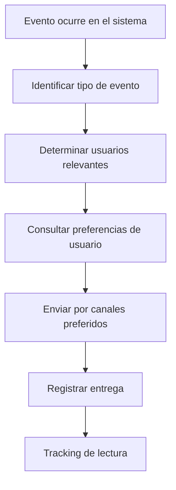

# Workflow - Notifications

Sistema integral de notificaciones para mantener informados a todos los usuarios sobre eventos relevantes del sistema.

## 📢 **Concepto General del Sistema**

### **Principio Básico**
Cada **evento importante** en el sistema dispara **notificaciones relevantes** solo a los **usuarios que les importa**, a través de sus **canales preferidos**.

### **Flujo Principal**

## 🔔 **Canales de Notificación**

### **3 Canales Principales**

#### **1. Email**
- **Uso**: Notificaciones importantes que requieren seguimiento
- **Ventajas**: Llega siempre, se puede leer después
- **Ejemplos**: Tareas asignadas, deadlines próximos, aprobaciones pendientes

#### **2. In-App (Dentro del sistema)**
- **Uso**: Notificaciones inmediatas mientras usa el sistema
- **Ventajas**: Contextual, no invasivo, con acciones directas
- **Ejemplos**: Nuevos comentarios, cambios de estado, menciones

#### **3. Webhook (Integraciones externas)**
- **Uso**: Para conectar con Slack, Teams, o sistemas externos
- **Ventajas**: Integración con herramientas que ya usan
- **Ejemplos**: Alertas críticas, resúmenes de progreso

## 👥 **Notificaciones por Tipo de Usuario**

### **Cliente**
**Recibe notificaciones sobre**:
- Sus proyectos asignados
- Cambios de estado en sus tareas
- Solicitud de aprobación de entregables
- Deadlines próximos de revisión
- Comentarios dirigidos a él

**No recibe**:
- Tareas de otros clientes
- Problemas técnicos internos
- Gestión de inventario

### **Colaborador**
**Recibe notificaciones sobre**:
- Tareas que le asignan
- Cambios en sus tareas activas
- Comentarios en sus trabajos
- Equipos que debe devolver
- Deadlines de sus entregas

**No recibe**:
- Solicitudes de otros clientes (hasta que se asignen)
- Decisiones administrativas
- Problemas de otros colaboradores

### **Admin**
**Recibe notificaciones sobre**:
- Nuevas solicitudes pendientes
- Tareas vencidas en su equipo
- Problemas de inventario
- Conflictos de recursos
- Alertas de rendimiento

**También recibe**:
- Todo lo de colaborador (para supervisión)
- Escalamientos automáticos

### **SuperAdmin**
**Recibe notificaciones sobre**:
- Problemas críticos del sistema
- Alertas de seguridad
- Usuarios con problemas de acceso
- Métricas fuera de rango
- Cambios en configuraciones críticas

**También recibe**:
- Resúmenes ejecutivos
- Todo lo crítico de todos los niveles

## 🎯 **Eventos que Generan Notificaciones**

### **Relacionados con Tareas**

#### **Asignación de Tareas**
- **Evento**: Admin asigna tarea a colaborador
- **Notifica a**: Colaborador asignado
- **Canales**: Email + In-app
- **Mensaje**: "Te asignaron una nueva tarea: [Nombre de tarea]"

#### **Cambio de Estado de Tarea**
- **Evento**: Colaborador cambia estado de PENDIENTE a EN_PROGRESO
- **Notifica a**: Admin del proyecto + Cliente
- **Canales**: In-app (Admin), Email (Cliente si configurado)
- **Mensaje**: "La tarea [Nombre] cambió a En Progreso"

#### **Entregable Subido**
- **Evento**: Colaborador sube archivo/link
- **Notifica a**: Admin + Cliente
- **Canales**: Email + In-app
- **Mensaje**: "Nuevo entregable disponible para revisión"

#### **Deadline Próximo**
- **Evento**: Quedan 24 horas para deadline
- **Notifica a**: Colaborador responsable + Admin
- **Canales**: Email + In-app
- **Mensaje**: "La tarea [Nombre] vence mañana"

#### **Tarea Vencida**
- **Evento**: Deadline pasó sin completar
- **Notifica a**: Colaborador + Admin + SuperAdmin
- **Canales**: Email (todos) + Webhook (SuperAdmin)
- **Mensaje**: "URGENTE: Tarea [Nombre] está vencida"

### **Relacionados con Proyectos**

#### **Proyecto Completado**
- **Evento**: Todas las tareas aprobadas por cliente
- **Notifica a**: Cliente + Todo el equipo del proyecto
- **Canales**: Email + In-app
- **Mensaje**: "¡Proyecto [Nombre] completado exitosamente!"

#### **Proyecto en Riesgo**
- **Evento**: Más del 50% de tareas vencidas
- **Notifica a**: Admin + SuperAdmin
- **Canales**: Email + Webhook
- **Mensaje**: "ALERTA: Proyecto [Nombre] en riesgo crítico"

### **Relacionados con Usuarios**

#### **Nuevo Usuario Registrado**
- **Evento**: Usuario completa activación de cuenta
- **Notifica a**: Admin del departamento
- **Canales**: In-app
- **Mensaje**: "[Nombre] se registró como [Tipo de usuario]"

#### **Login desde Dispositivo Nuevo**
- **Evento**: Usuario hace login desde IP/dispositivo desconocido
- **Notifica a**: El usuario + Admin (si es sospechoso)
- **Canales**: Email
- **Mensaje**: "Login detectado desde nuevo dispositivo"

### **Relacionados con Inventario**

#### **Equipo por Devolver**
- **Evento**: Quedan 24 horas para devolución
- **Notifica a**: Usuario que tiene el equipo
- **Canales**: Email + In-app
- **Mensaje**: "Recordatorio: Devolver [Equipo] mañana"

#### **Equipo Vencido**
- **Evento**: Equipo no devuelto a tiempo
- **Notifica a**: Usuario + Admin
- **Canales**: Email + In-app + Webhook (Admin)
- **Mensaje**: "URGENTE: [Equipo] no devuelto a tiempo"

#### **Stock Bajo**
- **Evento**: Suministro cae por debajo del 20%
- **Notifica a**: Admin + SuperAdmin
- **Canales**: In-app + Email (SuperAdmin)
- **Mensaje**: "Stock bajo: [Suministro] - Quedan [Cantidad]"

### **Relacionados con Comentarios**

#### **Nuevo Comentario**
- **Evento**: Usuario deja comentario en tarea/proyecto
- **Notifica a**: Todos los involucrados en esa entidad
- **Canales**: In-app + Email (si configurado)
- **Mensaje**: "[Usuario] comentó en [Entidad]"

#### **Mención en Comentario**
- **Evento**: Usuario menciona a otro con @nombre
- **Notifica a**: Usuario mencionado
- **Canales**: In-app + Email
- **Mensaje**: "[Usuario] te mencionó en un comentario"

## ⏰ **Frecuencia y Agrupación**

### **Inmediatas**
Enviadas al momento:
- Tareas asignadas
- Menciones en comentarios
- Alertas de seguridad
- Equipos vencidos

### **Agrupadas (cada 30 minutos)**
Para evitar spam:
- Múltiples comentarios en la misma entidad
- Varios cambios de estado del mismo proyecto
- Actualizaciones de progreso

### **Resúmenes Diarios**
Enviados a las 8:00 AM:
- Tareas que vencen hoy
- Equipos a devolver hoy
- Proyectos que requieren atención
- Solicitudes pendientes (para Admin)

### **Resúmenes Semanales**
Enviados los lunes:
- Progreso general de proyectos
- Métricas de productividad
- Equipos más utilizados
- Resumen ejecutivo (para SuperAdmin)

## 🎛️ **Configuración de Preferencias**

### **Por Tipo de Usuario**

#### **Cliente**
**Configuración por defecto**:
- Actualizaciones de sus proyectos: Email + In-app
- Solicitudes de aprobación: Email + In-app
- Comentarios dirigidos: In-app
- Alertas del sistema: Solo In-app

#### **Colaborador**
**Configuración por defecto**:
- Tareas asignadas: Email + In-app
- Deadlines próximos: Email + In-app
- Comentarios en sus trabajos: In-app
- Alertas de equipos: In-app

#### **Admin**
**Configuración por defecto**:
- Solicitudes nuevas: Email + In-app
- Problemas de equipo: Email + In-app
- Tareas vencidas: Email + Webhook
- Alertas de rendimiento: In-app

#### **SuperAdmin**
**Configuración por defecto**:
- Alertas críticas: Email + In-app + Webhook
- Problemas de seguridad: Todos los canales
- Métricas fuera de rango: Email + Webhook
- Resúmenes ejecutivos: Email

### **Personalización Individual**
Cada usuario puede:
- Activar/desactivar tipos específicos de notificación
- Elegir canales por tipo de evento
- Configurar horarios de "no molestar"
- Establecer frecuencia (inmediato, diario, semanal)

## 🚦 **Escalamiento Automático**

### **Por Inactividad**

#### **Colaborador sin respuesta**
- **5 días sin actividad** → Notificar a Admin
- **7 días sin actividad** → Notificar a SuperAdmin
- **10 días sin actividad** → Considerar reasignación

#### **Admin sin evaluar solicitudes**
- **3 días sin evaluar** → Notificar a SuperAdmin
- **5 días sin evaluar** → Notificar a todo el equipo Admin
- **7 días sin evaluar** → Escalar a autoridad superior

#### **Cliente sin aprobar entregables**
- **7 días sin respuesta** → Recordatorio automático
- **14 días sin respuesta** → Notificar a Admin
- **21 días sin respuesta** → Admin puede aprobar automáticamente

### **Por Gravedad**

#### **Alertas de Rendimiento**
- **KPI 20% por debajo** → Alerta amarilla (In-app)
- **KPI 50% por debajo** → Alerta roja (Email + In-app)
- **Sistema crítico** → Alerta crítica (Todos los canales)

## 📱 **Horarios y Contexto**

### **Respeto por Horarios**
- **Horario laboral**: 8:00 AM - 6:00 PM
- **Notificaciones normales**: Solo en horario laboral
- **Notificaciones urgentes**: Cualquier hora
- **Fines de semana**: Solo críticas

### **Contexto Geográfico**
- **Zona horaria**: Configurada por usuario
- **Días festivos**: Respetados según país/región
- **Vacaciones**: Notificaciones pausadas o reducidas

## 🔄 **Integración con Otros Workflows**

### **Con Projects-Tasks**
- Cada cambio de estado genera notificación
- Asignaciones disparan notificaciones inmediatas
- Deadlines generan recordatorios automáticos

### **Con Users**
- Nuevos usuarios reciben notificaciones de bienvenida
- Cambios de rol notifican al usuario y supervisores
- Ex-empleados dejan de recibir notificaciones

### **Con Inventory**
- Reservas y devoluciones generan recordatorios
- Problemas de equipos alertan a responsables
- Stock bajo alerta a administradores

### **Con Comments**
- Nuevos comentarios notifican a involucrados
- Menciones generan notificaciones inmediatas
- Respuestas notifican al autor original

## 📊 **Métricas del Sistema**

### **Efectividad de Notificaciones**
- **Tasa de apertura** por canal
- **Tiempo de respuesta** promedio
- **Acciones tomadas** desde notificaciones
- **Usuarios que desactivan** tipos específicos

### **Optimización Automática**
- **Reducir frecuencia** si usuario no responde
- **Cambiar canal** si email no se abre
- **Agrupar más** si usuario recibe muchas notificaciones
- **Sugerir ajustes** en configuración

## ⚙️ **Configuraciones del Sistema**

### **Límites y Umbrales**
- **Máximo 10 notificaciones** por usuario por hora
- **Agrupar si más de 3** del mismo tipo en 30 minutos
- **Pausar usuario** si marca como spam 5 veces
- **Auto-cleanup** de notificaciones mayores a 30 días

### **Templates de Mensajes**
- **Personalizables** por tipo de evento
- **Variables dinámicas** (nombres, fechas, etc.)
- **Multiidioma** si es necesario
- **Tono apropiado** según gravedad

## 🚨 **Casos Especiales**

### **Emergencias del Sistema**
- **Servidor caído** → Webhook inmediato a SuperAdmin
- **Base de datos corrupta** → Notificación crítica
- **Brecha de seguridad** → Alerta máxima prioridad

### **Eventos Masivos**
- **Deploy del sistema** → Notificar a todos sobre mantenimiento
- **Cambio de políticas** → Email masivo con nueva información
- **Celebraciones** → Notificaciones positivas (proyectos completados)

---

**Relacionado con**:
- [Workflow Projects-Tasks](/documentacion-tecnica/workflows/workflow-projects-tasks) - Para notificaciones de tareas y proyectos
- [Workflow Users](/documentacion-tecnica/workflows/workflow-users) - Para preferencias y permisos de notificación
- [Workflow Comments](/documentacion-tecnica/workflows/workflow-comments) - Para notificaciones de comentarios y menciones