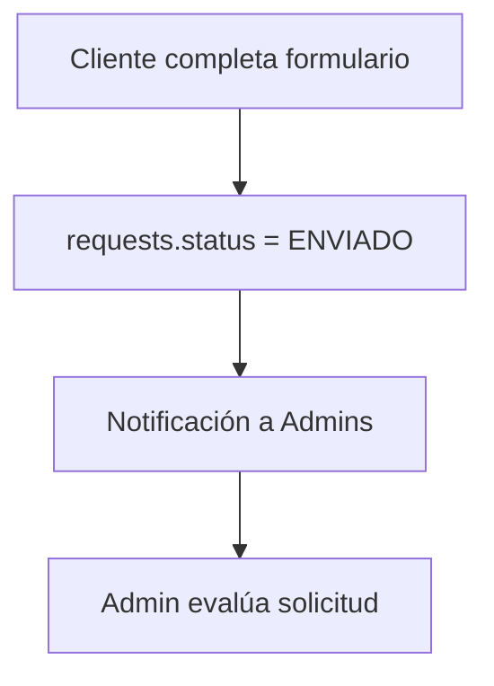
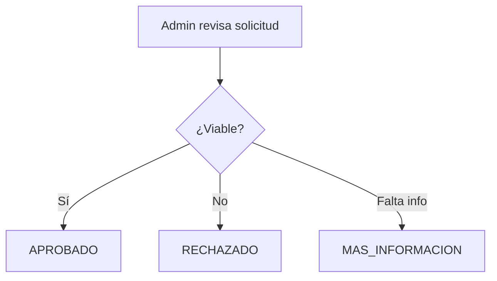
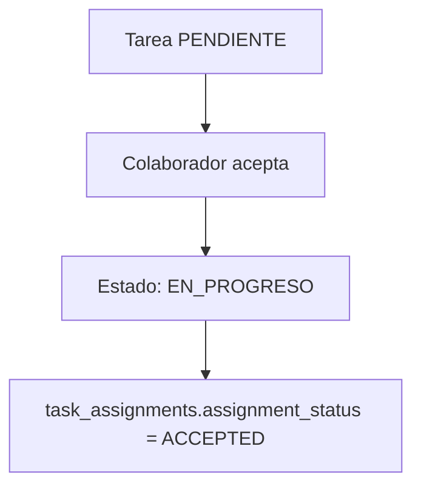
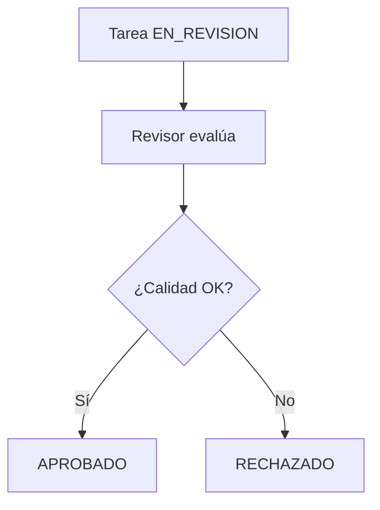
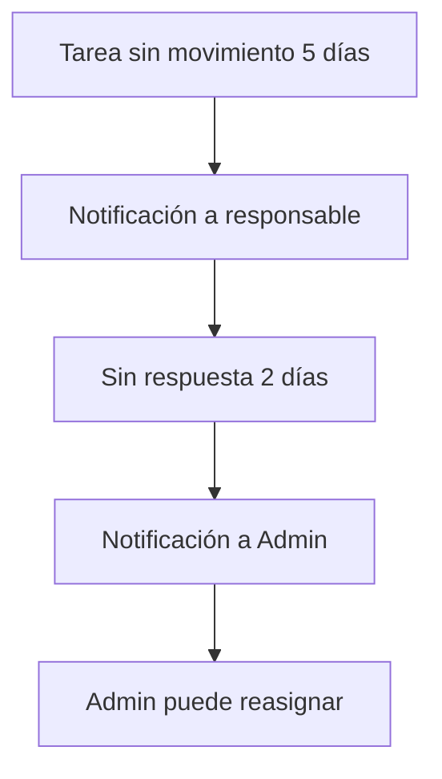

# Flujos de Trabajo Completos

Documentación detallada de todos los flujos de trabajo del sistema, desde solicitud inicial hasta entrega final.

## 🔄 **Flujo Principal: Solicitud → Entrega**

### **Fase 1: Solicitud del Cliente**

#### **Estado Inicial: ENVIADO**


**Actores**: Cliente  
**Duración típica**: Inmediato  
**Notificaciones**: 
- Admin recibe notificación `REQUEST_RECEIVED`
- Cliente recibe confirmación de envío

**Campos requeridos en solicitud**:
- `title` - Título descriptivo
- `description` - Descripción detallada del servicio
- `service_type_id` - Tipo de servicio solicitado
- `priority_id` - Prioridad sugerida por cliente
- `requested_date` - Fecha deseada de entrega

#### **Evaluación: EN_EVALUACION**


**Actores**: Admin  
**Duración típica**: 1-3 días laborales  
**Decisiones posibles**:

##### ✅ **APROBADO**
- Se convierte automáticamente en proyecto
- `requests.converted_project_id` se llena
- Cliente recibe notificación `REQUEST_APPROVED`
- Se crean tareas iniciales del proyecto

##### ❌ **RECHAZADO**
- **Comentario obligatorio** explicando razón
- Fin del proceso para esta solicitud
- Cliente recibe notificación `REQUEST_REJECTED`
- No se puede reabrir, debe crear nueva solicitud

##### ⚠️ **MAS_INFORMACION**
- **Comentario obligatorio** especificando qué información falta
- Regresa a cliente para completar
- Cliente recibe notificación `REQUEST_MORE_INFO`
- Cliente puede editar y reenviar (vuelve a `ENVIADO`)

**Casos Edge**:
- **Solicitud abandonada**: Si cliente no responde en 30 días → Auto-rechazar
- **Admin sin respuesta**: Si no hay respuesta en 7 días → Notificar SuperAdmin
- **Información incompleta repetida**: Si cliente envía info incompleta 3 veces → Escalar a reunión

### **Fase 2: Creación del Proyecto**

#### **Conversión Automática**
Cuando una solicitud se aprueba:

```sql
-- Se crea el proyecto automáticamente
INSERT INTO projects (
    name = request.title,
    description = request.description,
    client_id = request.client_id,
    service_type_id = request.service_type_id,
    priority_id = request.priority_id,
    status_id = (SELECT id FROM status_options WHERE code = 'SOLICITADO'),
    request_date = request.requested_date
)
```

**Estado inicial del proyecto**: `SOLICITADO`

#### **Planificación: PLANIFICACION**
**Actores**: Admin  
**Duración típica**: 1-2 días

**Tareas del Admin**:
1. **Asignar unidades participantes** (`project_units`)
2. **Crear tareas principales** basado en `service_type_id`
3. **Asignar colaboradores** a tareas
4. **Reservar equipos** necesarios
5. **Definir fechas** de inicio y entrega

**Auto-transición**: Cuando se crean las primeras tareas → `EN_PROGRESO`

### **Fase 3: Ejecución de Tareas (3 Niveles)**

#### **Nivel 1: Ejecución por Colaborador**

##### **PENDIENTE → EN_PROGRESO**
**Actores**: Colaborador asignado  
**Trigger**: Colaborador actualiza estado manualmente



**Notificaciones**:
- Admin recibe actualización de progreso
- Cliente recibe notificación si es tarea visible

##### **EN_PROGRESO → ENTREGADO**
**Actores**: Colaborador  
**Trigger**: Colaborador sube entregables y marca como entregado

**Requisitos para marcar ENTREGADO**:
- ✅ Al menos 1 entregable subido (`deliverables`)
- ✅ Todos los enlaces requeridos agregados (`task_links`)
- ✅ Comentario opcional de entrega

**Auto-transición**: Al marcar ENTREGADO → `EN_REVISION` (Nivel 2)

#### **Nivel 2: Revisión Interna**

##### **EN_REVISION**
**Actores**: Admin o SuperAdmin  
**Duración típica**: 1-2 días



**Requisitos para revisar**:
- Revisar todos los entregables
- Verificar calidad técnica
- Validar que cumple especificaciones

##### **Decisiones del Revisor**:

**✅ APROBADO**
- Entregable pasa a Nivel 3 (Cliente)
- Estado automático: `REVISION_CLIENTE`
- Cliente recibe notificación para revisar

**❌ RECHAZADO**
- **Comentario obligatorio** con feedback específico
- Regresa a `PENDIENTE` (Nivel 1)
- Colaborador recibe notificación `TASK_REJECTED`
- Se mantiene historial de intentos en `task_approvals`

#### **Nivel 3: Revisión del Cliente**

##### **REVISION_CLIENTE**
**Actores**: Cliente original del proyecto  
**Duración típica**: 2-5 días

**Cliente puede**:
- Ver todos los entregables
- Descargar archivos
- Acceder a enlaces (Drive, YouTube, etc.)
- Dejar comentarios específicos

##### **Decisiones del Cliente**:

**✅ APROBADO_CLIENTE**
- Tarea se marca como `COMPLETADO`
- Progreso del proyecto se actualiza automáticamente
- Colaborador recibe notificación `TASK_APPROVED`

**❌ RECHAZADO_CLIENTE**
- **Comentario obligatorio** con feedback del cliente
- Regresa a `EN_REVISION` (Nivel 2)
- Admin y colaborador reciben notificación
- Admin debe decidir si acepta feedback o escala

**Casos Edge en Nivel 3**:
- **Cliente sin respuesta**: 7 días → Recordatorio automático
- **Cliente sin respuesta**: 14 días → Notificar Admin
- **Cliente sin respuesta**: 21 días → Admin puede aprobar automáticamente

### **Fase 4: Completado del Proyecto**

#### **Cálculo Automático de Progreso**
```sql
-- Fórmula de progreso del proyecto
SELECT 
    (COUNT(*) FILTER (WHERE status_code IN ('APROBADO_CLIENTE', 'COMPLETADO')) * 100.0 / COUNT(*)) as progress_percentage
FROM tasks t
JOIN status_options so ON t.status_id = so.id
WHERE t.project_id = ?
```

#### **Estados Finales del Proyecto**:

**`COMPLETADO`**: Cuando 100% de tareas están `APROBADO_CLIENTE`
- Cliente recibe notificación `PROJECT_COMPLETED`
- Equipos se liberan automáticamente
- Se generan métricas finales del proyecto

**`EN_PAUSA`**: Solo por decisión manual de Admin
- Todas las tareas se pausan
- Equipos se liberan temporalmente
- Se programa fecha de reanudación

**`CANCELADO`**: Solo por decisión de Admin o SuperAdmin
- Todas las tareas se cancelan
- Equipos se liberan inmediatamente
- Se registra razón de cancelación

## 🚨 **Timeouts y Escalamiento Automático**

### **Timeouts por Fase**

| Fase | Actor | Timeout | Acción Automática |
|------|-------|---------|-------------------|
| Evaluación solicitud | Admin | 7 días | Notificar SuperAdmin |
| Respuesta cliente (MAS_INFORMACION) | Cliente | 30 días | Auto-rechazar solicitud |
| Ejecución de tarea | Colaborador | Fecha límite + 2 días | Notificar Admin |
| Revisión interna | Admin | 3 días | Recordatorio + escalamiento |
| Revisión cliente | Cliente | 21 días | Admin puede aprobar |

### **Escalamiento por Inactividad**

#### **Tareas Estancadas**


#### **Proyectos en Riesgo**
**Criterios de riesgo**:
- ✅ 50% de tareas vencidas
- ✅ Sin progreso en 10 días
- ✅ Cliente sin respuesta en múltiples tareas

**Acciones automáticas**:
- Marcar proyecto como "EN RIESGO"
- Notificación diaria a Admin
- Incluir en dashboard de alertas

## 🔄 **Flujos Especiales**

### **Reasignación de Tareas**
**Triggers para reasignación**:
- Colaborador solicita reasignación
- Colaborador se va de licencia/vacaciones
- Admin detecta sobrecarga de trabajo
- Tarea requiere especialidad diferente

**Proceso de reasignación**:
1. Admin selecciona nuevo colaborador
2. Sistema valida disponibilidad y especialidades
3. Se notifica a ambos colaboradores (anterior y nuevo)
4. Se preserva historial en `task_assignments`
5. Nuevo colaborador debe aceptar asignación

### **Proyectos Urgentes**
**Criterios para urgencia**:
- `priority_id` = "URGENTE" o "CRITICA"
- Fecha de entrega en menos de 48 horas
- Marcado manualmente por SuperAdmin

**Flujo especial**:
- Revisión interna reducida a 4 horas
- Notificaciones inmediatas en cada cambio
- Prioridad alta en asignación de equipos
- Dashboard especial para tracking

### **Proyectos de Múltiples Fases**
Para proyectos grandes (ej: serie de podcast, curso completo):

**Estructura**:
- 1 Proyecto principal (`project_type = "PODCAST"`)
- N Episodios como sub-proyectos (`podcast_episodes`)
- Cada episodio tiene sus propias tareas

**Dependencias**:
- Episodio N+1 no puede empezar hasta que N esté en `REVISION_CLIENTE`
- Equipos se pueden reservar en bloques
- Cliente aprueba episodio por episodio

## 📊 **Métricas de Flujo**

### **KPIs por Fase**
- **Tiempo promedio de evaluación**: Meta < 2 días
- **Tiempo promedio Nivel 1**: Meta según tipo de servicio
- **Tiempo promedio Nivel 2**: Meta < 1 día
- **Tiempo promedio Nivel 3**: Meta < 3 días
- **% de rechazos por nivel**: Meta < 20%
- **% de proyectos completados a tiempo**: Meta > 90%

### **Alertas de Performance**
- ⚠️ **Amarilla**: KPI 20% por encima de meta
- 🚨 **Roja**: KPI 50% por encima de meta
- 🔥 **Crítica**: Múltiples KPIs en rojo simultáneamente

## 🔧 **Configuraciones del Flujo**

### **Configuraciones Críticas** (tabla `configurations`)

| Key | Value | Descripción |
|-----|-------|-------------|
| `workflow.timeout.request_evaluation` | 7 | Días para evaluar solicitud |
| `workflow.timeout.client_response` | 30 | Días para respuesta cliente |
| `workflow.timeout.internal_review` | 3 | Días para revisión interna |
| `workflow.timeout.client_review` | 21 | Días para revisión cliente |
| `workflow.auto_approve_threshold` | 21 | Días para auto-aprobación |
| `workflow.escalation_enabled` | true | Activar escalamiento automático |
| `workflow.risk_criteria.overdue_percentage` | 50 | % tareas vencidas = riesgo |

### **Notificaciones por Flujo**

Cada transición de estado dispara notificaciones específicas según el tipo de usuario y configuración personal del usuario en `user_notification_preferences`.

---

**Próximos documentos a crear**:
- Sistema de Comentarios y Feedback
- Manejo de Conflictos y Concurrencia
- Gestión de Ex-empleados y Datos Huérfanos