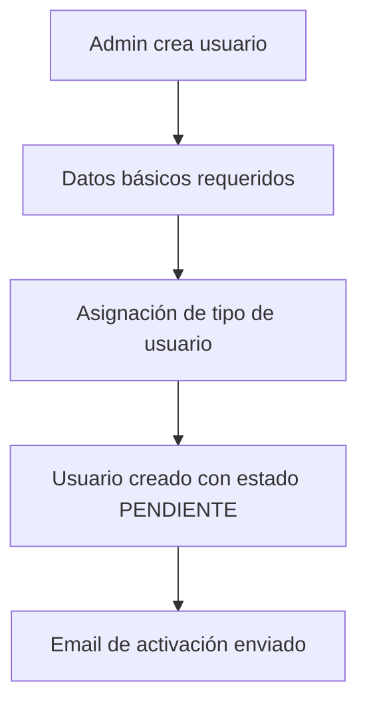
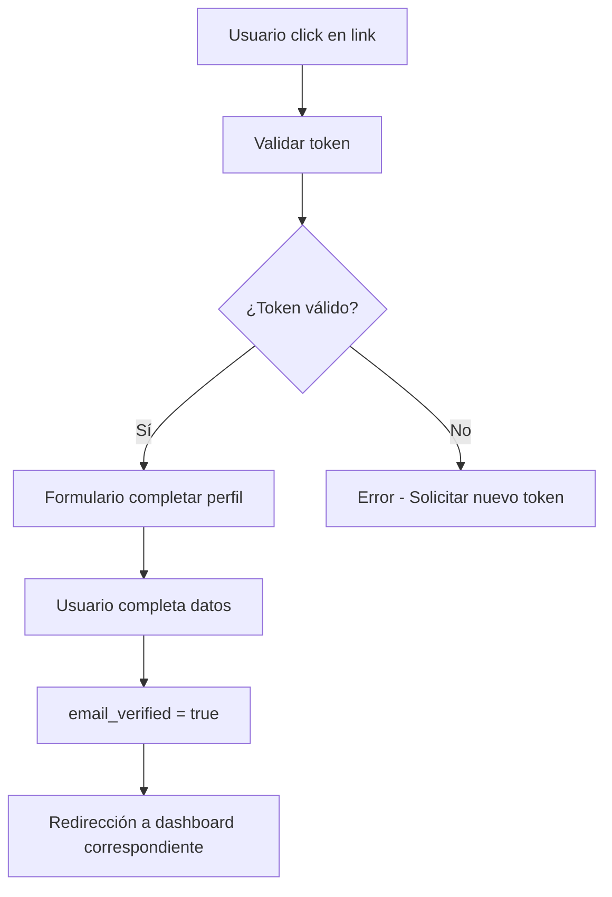
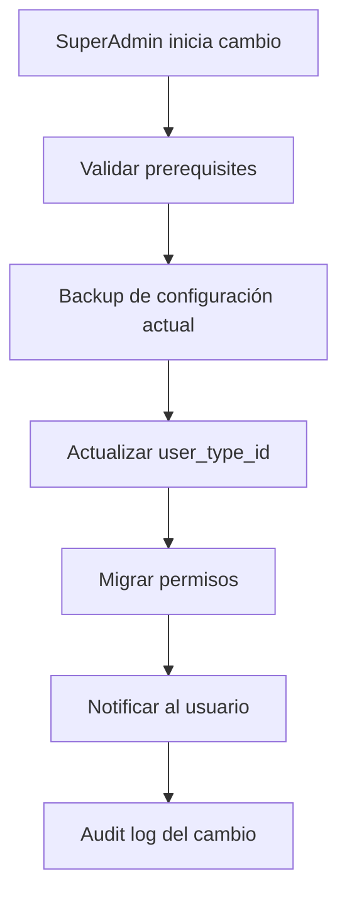
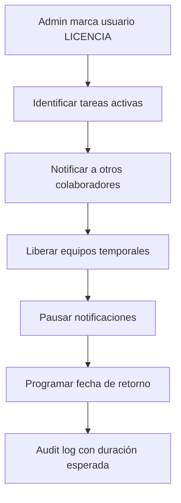
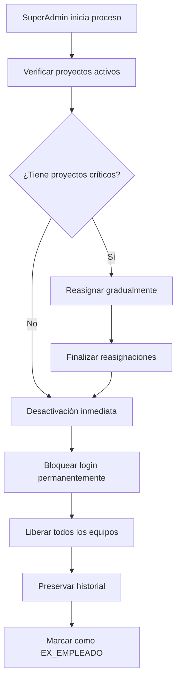
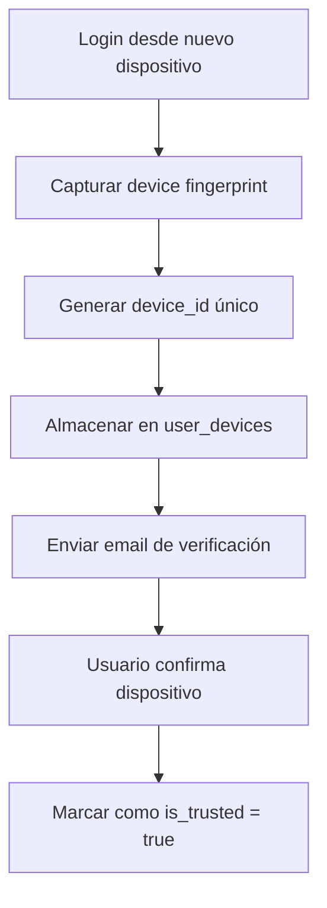
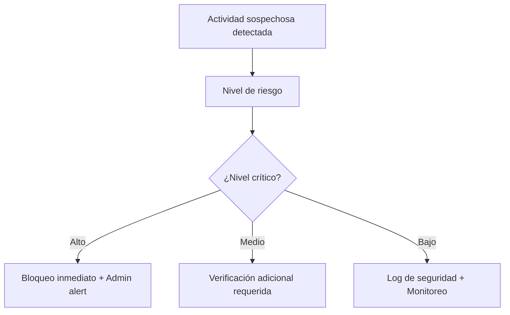

# Workflow - Users

Documentación completa de todos los flujos relacionados con gestión de usuarios, desde onboarding hasta desactivación.

## 👤 **Flujo de Onboarding - Nuevo Usuario**

### **Fase 1: Creación de Usuario**

#### **Trigger**: Admin o SuperAdmin crea nuevo usuario



**Datos requeridos**:
- `name` - Nombre completo
- `email` - Email único institucional
- `user_type_id` - Tipo de usuario (CLIENT, COLLABORATOR, ADMIN, SUPERADMIN)
- `unit_id` - Unidad organizacional (solo internos)
- `employee_role_id` - Rol específico (solo internos)

**Estados iniciales**:
- `is_active` = `true`
- `email_verified` = `false`
- `is_internal` = `true/false` (según user_type)

#### **Validaciones automáticas**:
- ✅ Email no existe previamente
- ✅ Unidad existe y está activa
- ✅ Rol es compatible con tipo de usuario
- ✅ Permisos del creador para asignar ese tipo

### **Fase 2: Activación de Cuenta**

#### **Usuario recibe email con token de activación**



**Datos adicionales a completar**:
- `password` - Contraseña segura
- `phone` - Teléfono de contacto
- `avatar_url` - Foto de perfil (opcional)
- `specialties` - Especialidades técnicas (solo colaboradores)

**Validaciones**:
- ✅ Contraseña cumple políticas de seguridad
- ✅ Teléfono en formato válido
- ✅ Avatar URL es accesible (si se proporciona)

#### **Post-activación automática**:
1. **Registro de dispositivo** → `user_devices` con device fingerprint
2. **Notificación a Admin** → Usuario activado correctamente
3. **Configuración de preferencias por defecto** → `user_notification_preferences`
4. **Asignación de permisos** → Según `user_type.permissions`

### **Fase 3: Configuración Inicial (Solo Colaboradores)**

#### **Asignación de Especialidades**

```json
{
  "CAMAROGRAFO": {
    "equipment": ["CAMARA_DSLR", "CAMARA_VIDEO", "ESTABILIZADOR"],
    "skills": ["grabacion_video", "fotografia", "streaming_live"],
    "certifications": ["drone_license", "lighting_basic"]
  },
  "EDITOR": {
    "software": ["premiere_pro", "after_effects", "davinci_resolve"],
    "specialties": ["color_grading", "audio_mixing", "motion_graphics"],
    "output_formats": ["4K", "HD", "social_media", "web"]
  },
  "DISEÑADOR": {
    "software": ["photoshop", "illustrator", "figma", "indesign"],
    "specialties": ["graphic_design", "ui_ux", "branding", "print_design"],
    "output_types": ["digital", "print", "web", "social_media"]
  }
}
```

#### **Asignación de Equipos Permanentes** (opcional)
- Laptop personal del colaborador
- Cámara asignada específicamente
- Accesorios de uso personal

## 🔄 **Flujo de Cambio de Roles**

### **Promoción: Colaborador → Admin**

#### **Trigger**: SuperAdmin decide promoción



**Prerequisites validados**:
- ✅ Usuario tiene al menos 6 meses en el sistema
- ✅ No tiene tareas críticas pendientes
- ✅ Performance rating mayor a 4.0 (si existe sistema de rating)

**Migración automática**:
1. **Permisos expandidos** → De COLLABORATOR a ADMIN permissions
2. **Dashboard access** → Mantiene `/dashboard/` pero con funciones admin
3. **Notificaciones** → Recibe alertas de gestión de proyectos
4. **Equipos asignados** → Se mantienen los asignados permanentemente

**Periodo de transición** (30 días):
- Usuario puede acceder a funciones admin gradualmente
- Mentor asignado (otro admin) para capacitación
- Monitoreo especial de acciones críticas

### **Degradación: Admin → Colaborador**

#### **Trigger**: Decisión disciplinaria o reorganización

**Proceso más cuidadoso**:
1. **Evaluación de dependencias** → ¿Qué proyectos gestiona actualmente?
2. **Reasignación gradual** → Transferir responsabilidades a otro admin
3. **Revocación de permisos** → Paso a paso, no abrupto
4. **Notificación a equipo** → Transparencia en el cambio
5. **Plan de retención** → Evitar que se vaya de la empresa

## 🚫 **Flujo de Desactivación de Usuario**

### **Desactivación Temporal (Licencia/Vacaciones)**

#### **Estados especiales para colaboradores**:

| Estado | Login | Asignaciones | Equipos | Notificaciones |
|--------|-------|--------------|---------|----------------|
| **VACACIONES** | ✅ | Solo lectura | Mantiene | Reducidas |
| **LICENCIA** | ❌ | Reasignables | Libera temporales | Pausadas |
| **SUSPENSION** | ❌ | Pausadas | Libera todos | Pausadas |

#### **Proceso automático en cambio a LICENCIA**:



**Equipos liberados automáticamente**:
- ✅ Equipos reservados para tareas específicas
- ✅ Equipos temporales (proyectores, cámaras grandes)
- ❌ Equipos permanentes (laptop personal, cámara asignada)

### **Desactivación Permanente (Ex-empleado)**

#### **Proceso de Ex-empleado**



**Preservación de historial**:
- ✅ Todas las tareas quedan como "Creado por [Nombre] (Ex-empleado)"
- ✅ Proyectos liderados quedan con nota histórica
- ✅ Audit logs se mantienen íntegros
- ✅ Comentarios y feedback previo se preserva

**Liberación de recursos**:
- ✅ Todos los equipos → Estado DISPONIBLE
- ✅ Tareas activas → Reasignadas a otros colaboradores
- ✅ Reservas futuras → Canceladas automáticamente
- ✅ Accesos y dispositivos → Revocados

## 🔐 **Flujo de Gestión de Dispositivos**

### **Registro de Nuevo Dispositivo**

#### **Usuario hace login desde dispositivo desconocido**



**Información capturada automáticamente**:
- `device_fingerprint` - Hash único del dispositivo
- `browser` - Navegador utilizado
- `os` - Sistema operativo detectado
- `ip_address` - IP de acceso
- `user_agent` - String completo del user agent

#### **Dispositivo no verificado (primeras 48 horas)**:
- ⚠️ Sesión limitada a 2 horas
- ⚠️ Funciones críticas bloqueadas
- ⚠️ Notificaciones adicionales de seguridad

#### **Dispositivo confiable (verificado)**:
- ✅ Sesión extendida (30 días)
- ✅ Login automático recordado
- ✅ Acceso completo a funcionalidades

### **Detección de Actividad Sospechosa**

#### **Patrones que disparan alertas**:

| Patrón | Umbral | Acción Automática |
|--------|--------|-------------------|
| Múltiples logins fallidos | 5 en 10 min | Bloquear usuario 30 min |
| Login desde nuevo país | Inmediato | Email de verificación |
| Múltiples dispositivos simultáneos | 3 o más activos | Alertar usuario |
| Cambio súbito de ubicación | Más de 500km en menos de 1h | Verificación adicional |

#### **Escalamiento de seguridad**:



## 🔔 **Flujo de Notificaciones de Usuario**

### **Configuración de Preferencias**

#### **Preferencias por defecto según user_type**:

```json
{
  "CLIENT": {
    "task_updates": {"email": true, "in_app": true},
    "project_milestones": {"email": true, "in_app": true},
    "system_alerts": {"email": false, "in_app": true}
  },
  "COLLABORATOR": {
    "task_assignments": {"email": true, "in_app": true},
    "deadline_reminders": {"email": true, "in_app": true},
    "equipment_alerts": {"email": false, "in_app": true}
  },
  "ADMIN": {
    "all_collaborator_notifications": true,
    "request_alerts": {"email": true, "in_app": true},
    "system_issues": {"email": true, "in_app": true}
  },
  "SUPERADMIN": {
    "all_notifications": true,
    "security_alerts": {"email": true, "in_app": true, "webhook": true},
    "system_critical": {"email": true, "in_app": true, "webhook": true}
  }
}
```

#### **Personalización por usuario**:
- Usuario puede ajustar cada tipo de notificación individualmente
- Horarios de "no molestar" configurables
- Frecuencia: Inmediata, Resumen diario, Resumen semanal
- Canales preferidos por tipo de evento

### **Flujo de Escalamiento por User Type**

#### **Escalamiento automático por inactividad**:

| User Type | Sin actividad | Acción |
|-----------|---------------|--------|
| CLIENT | 30 días | Email recordatorio proyecto |
| COLLABORATOR | 5 días | Notificar Admin |
| ADMIN | 3 días | Notificar SuperAdmin |
| SUPERADMIN | 7 días | Alerta crítica |

## 📊 **Métricas de Usuario**

### **KPIs por Tipo de Usuario**

#### **Colaboradores**:
- **Tiempo promedio de respuesta** a asignaciones
- **Porcentaje de tareas completadas a tiempo**
- **Calidad promedio** de entregables (rating)
- **Utilización de equipos** asignados

#### **Administradores**:
- **Tiempo promedio de evaluación** de solicitudes
- **Porcentaje de proyectos entregados a tiempo** bajo su gestión
- **Satisfacción promedio** de clientes

#### **Clientes**:
- **Tiempo promedio de feedback** en revisiones
- **Porcentaje de aprobaciones** en primera revisión
- **Satisfacción** con servicios recibidos

### **Alertas de Performance**

#### **Indicadores de riesgo por usuario**:
- 🔴 **Crítico**: KPI más del 50% por debajo de promedio
- 🟡 **Atención**: KPI 20-50% por debajo de promedio
- 🟢 **Normal**: KPI dentro del rango esperado
- ⭐ **Excelente**: KPI más del 20% por encima de promedio

## ⚙️ **Configuraciones de Usuario**

### **Configuraciones Críticas** (tabla `configurations`)

| Key | Value | Descripción |
|-----|-------|-------------|
| `users.onboarding.token_expiry` | 72 | Horas para activar cuenta |
| `users.password.min_length` | 8 | Longitud mínima de contraseña |
| `users.password.require_symbols` | true | Requerir símbolos especiales |
| `users.session.timeout_hours` | 8 | Timeout de sesión inactiva |
| `users.device.verification_required` | true | Verificar nuevos dispositivos |
| `users.security.max_failed_attempts` | 5 | Intentos antes de bloqueo temporal |
| `users.escalation.inactive_days` | 7 | Días sin actividad para alertar |

### **Validaciones de Integridad**

#### **Jobs automáticos de mantenimiento**:
- **Diario**: Verificar usuarios con dispositivos huérfanos
- **Semanal**: Detectar cuentas inactivas por tipo
- **Mensual**: Limpiar tokens expirados y sesiones antigas
- **Trimestral**: Auditoría de permisos vs funciones reales

---

**Relacionado con**:
- [Workflow Projects-Tasks](/documentacion-tecnica/workflows/workflow-projects-tasks) - Para asignaciones y colaboración
- [Workflow Inventory](/documentacion-tecnica/workflows/workflow-inventory) - Para gestión de equipos por usuario